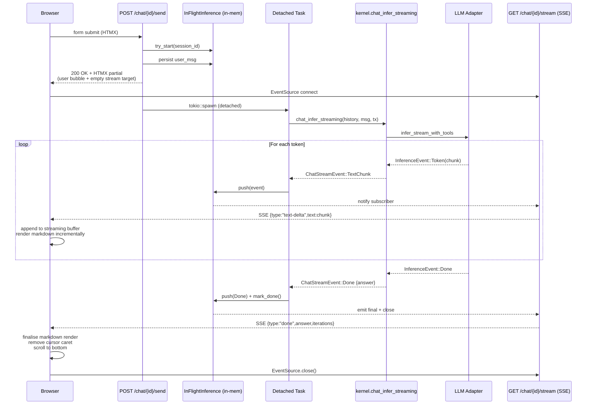
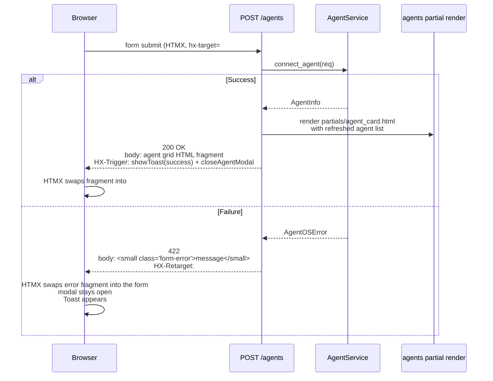

# WebUI Overhaul Data Flow

> Step-by-step diagrams of the new data flow for the chat streaming pipeline, the connect-agent submission, and the task detail log stream after the overhaul.

---

## 1. Chat Streaming Pipeline (NEW)

### Overview Diagram



### New SSE Event Schema

Every event uses a single envelope shape (drop the per-event JSON-vs-text inconsistency):

```typescript
type ChatStreamFrame =
  | { type: "thinking";    iteration: number;             }
  | { type: "text-delta";  text: string;                  }
  | { type: "tool-start";  tool_name: string; iteration: number; intent?: any; }
  | { type: "tool-result"; tool_name: string; success: bool; duration_ms: number;
                           output_preview?: string; error?: string;            }
  | { type: "iteration";   iteration: number; reason: string; }
  | { type: "done";        answer: string; iterations: number; tokens_used?: number; }
  | { type: "error";       message: string;               }
```

The SSE event name stays as `chat-stream` for *all* frames; the `type` field discriminates. This collapses 7 listener registrations to one.

### Browser-side Render Pipeline

```
Receive frame ──► branch on type
                    │
        ┌───────────┼─────────────┬──────────┬──────────┬─────────┐
        ▼           ▼             ▼          ▼          ▼         ▼
    "thinking"  "text-delta"  "tool-start" "tool-result" "iteration" "done"
        │           │             │          │             │         │
        ▼           ▼             ▼          ▼             ▼         ▼
    add chip    raw_buf+=text  push tool   update tool   marker   finalise
                marked.parse   card        card status   row      cursor off
                DOMPurify                                          markdown
                replace inner                                      final pass
                                                                  scroll btm
```

The `raw_buf` is the source of truth — markdown is re-parsed on every chunk (cheap because chunks are small). DOMPurify strips dangerous tags. The result is set as innerHTML on the streaming text div.

### Memory Caps

`InFlightInference.events` gets a `MAX_EVENTS = 10_000` cap. When exceeded, drop the oldest text-delta events (keep tool-* and iteration boundaries) and emit a synthetic `text-delta` event with `[…truncated…]` once.

---

## 2. Connect Agent Submission (NEW)

### Old Flow (broken)

```
Browser submits form
  → POST /agents (HTMX)
    → handler succeeds
      → 303 Redirect to /agents
        → HTMX follows redirect with fetch
          → GET /agents returns FULL HTML page
            → HTMX swaps full HTML into #agent-grid (broken)
```

### New Flow



Key differences from the old flow:
- No redirect.
- Success: returns the fully-rendered agent grid partial (not the whole page).
- Failure: uses `HX-Retarget` to swap the error message into a dedicated `#connect-form-error` div *inside* the modal, leaving the modal open so the user can correct the input.
- Modal close uses an Alpine event listener on `closeAgentModal` rather than a blanket `@htmx:after-request`.

---

## 3. Task Detail Log Stream (NEW)

### Bounded DOM Diagram

```
              ┌───────────────────────────────────┐
   audit log  │  Server: SSE every 1s             │
   poll       │  + max lifetime 30 min            │
              │  + close on terminal state        │
              │  + Last-Event-ID resume support   │
              └───────────────┬───────────────────┘
                              │
                              ▼
                ┌─────────────────────────────┐
                │   Browser: ring buffer JS    │
                │   max_lines = 5000           │
                │   on overflow → drop oldest  │
                │   show "(N lines hidden)"   │
                │   visible lines = real DOM   │
                └──────────────┬───────────────┘
                               │
                               ▼
                ┌─────────────────────────────┐
                │  Auto-scroll if user is at   │
                │  bottom; otherwise pin       │
                │  position and show           │
                │  "↓ N new" button            │
                └─────────────────────────────┘
```

### Server-side Stream Lifetime

`tasks::log_stream` gets:
- `MAX_STREAM_LIFETIME = 30 min` — after this, the stream emits a `done` event and closes regardless of task state.
- `IDLE_TIMEOUT = 10 min` — if no new audit entries for this period AND task is not terminal, emit a `paused` event and slow polling to 10s. Resume on next audit entry.
- Client uses `Last-Event-ID` header to resume from the last seen audit ID after browser tab regains focus.

### Browser-side Ring Buffer

```javascript
const MAX_LINES = 5000;
const TRIM_BATCH = 100;  // remove 100 at a time to amortise DOM cost

function appendLine(text) {
    if (!text.trim()) return;
    const line = document.createElement('div');
    line.className = 'log-line ' + classifyLine(text);
    line.textContent = text;
    terminal.appendChild(line);

    // Cap DOM size
    if (terminal.childElementCount > MAX_LINES) {
        for (let i = 0; i < TRIM_BATCH; i++) {
            terminal.firstElementChild?.remove();
        }
        droppedLines += TRIM_BATCH;
        droppedBanner.textContent = `(${droppedLines} earlier lines hidden)`;
        droppedBanner.hidden = false;
    }

    if (autoscrollCheck.checked) {
        terminal.scrollTop = terminal.scrollHeight;
    }
}
```

---

## 4. Tool Call Storage Migration (NEW)

### Schema Change

```sql
-- Existing
CREATE TABLE chat_messages (
    id INTEGER PRIMARY KEY,
    session_id TEXT,
    role TEXT CHECK(role IN ('user','assistant','tool')),
    content TEXT,
    tool_name TEXT,
    tool_duration_ms INTEGER,
    created_at TEXT
);

-- NEW
CREATE TABLE chat_tool_calls (
    id INTEGER PRIMARY KEY AUTOINCREMENT,
    session_id TEXT NOT NULL REFERENCES chat_sessions(id) ON DELETE CASCADE,
    after_message_id INTEGER REFERENCES chat_messages(id),
    iteration INTEGER NOT NULL DEFAULT 1,
    tool_name TEXT NOT NULL,
    intent_type TEXT,
    payload_json TEXT NOT NULL,
    result_json TEXT NOT NULL,
    success INTEGER NOT NULL DEFAULT 1,
    duration_ms INTEGER NOT NULL DEFAULT 0,
    created_at TEXT NOT NULL
);

CREATE INDEX idx_chat_tool_calls_session ON chat_tool_calls(session_id, created_at);
```

### Migration

```sql
-- Migrate existing role='tool' rows
INSERT INTO chat_tool_calls (session_id, tool_name, intent_type, payload_json, result_json, duration_ms, created_at)
SELECT
    session_id,
    COALESCE(tool_name, 'unknown'),
    json_extract(content, '$.intent_type'),
    COALESCE(json_extract(content, '$.payload'), '{}'),
    COALESCE(json_extract(content, '$.result'), '{}'),
    COALESCE(tool_duration_ms, 0),
    created_at
FROM chat_messages
WHERE role = 'tool';

DELETE FROM chat_messages WHERE role = 'tool';
```

### Render Path

`get_messages_with_tools(session_id) -> Vec<TimelineEntry>` returns interleaved entries:

```rust
pub enum TimelineEntry {
    UserMessage { id, content, created_at },
    AssistantMessage { id, content, created_at, tokens_used },
    ToolCall { id, tool_name, intent_type, payload_json, result_json, success, duration_ms, created_at },
}
```

The template iterates over this enum and renders each variant with its own partial:
- `partials/chat_user_msg.html`
- `partials/chat_assistant_msg.html` (with markdown filter)
- `partials/chat_tool_call.html` (with `pretty_json` filter and collapsible result)

---

## 5. New MiniJinja Filters

| Filter | Input | Output | Used by |
|--------|-------|--------|---------|
| `pretty_json` | string or value | indented JSON HTML with syntax classes | tool calls, task context |
| `human_role` | string ("user_message" / "USER_MESSAGE" / IntentType) | "User" / "Assistant" / "System" / "Tool" | task context |
| `humanize_event_type` | AuditEventType string | "Tool Executed" / "Memory Written" / etc. | audit log |
| `markdown` | string | sanitised HTML (server-side rendering for static contexts only) | help pages, agent descriptions |
| `relative_time` | datetime | "2 minutes ago" | timestamps everywhere |
| `truncate_middle` | string, n | "abc…xyz" | long IDs |
| `bytes_human` | int | "4.2 KB" | sizes |

The `markdown` filter wraps `pulldown_cmark::Parser::new` + `html::push_html` server-side. For chat (where markdown is rendered client-side during streaming), we use marked.js because incremental rendering is required.

---

## Related

- [[WebUI Overhaul Plan]]
- [[WebUI Overhaul Research]]
- [[01-chat-streaming-engine]]
- [[02-chat-ui-redesign]]
- [[03-template-rendering-fixes]]
