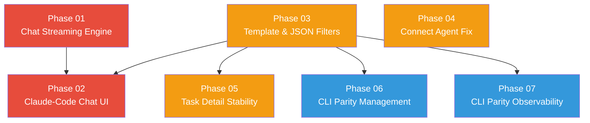

# WebUI Overhaul Plan

> Fix the broken parts of the AgentOS web UI (chat streaming, connect agent, task detail freeze, raw-JSON rendering) AND reach feature parity with `agentos` CLI by exposing every command group through a polished, user-friendly interface — including a Claude-Code-style chat that beautifully renders thinking, tool calls, and markdown.

---

## Why This Matters

The web UI has shipped enough surface area to feel "complete" but is functionally broken in the highest-traffic flows. Concrete user-reported issues observed in the running container (`agentos-kernel`, healthy as of `2026-04-11`):

1. **Chat does not stream incrementally.** Server-side `chat_infer_streaming` (logs at `kernel.rs:1500/1722`) emits `TextChunk` events token-by-token, but the browser shows the full response only at the end. Three culprits combine: (a) the `chat-stream.js` IIFE never handles `chat-thinking` (the only feedback frame the server emits before the first text chunk arrives); (b) the LLM adapter for several providers (`kimi-k2.5:cloud` is the test case) returns the entire body in one `Token` event because it parses the SSE response after the fact instead of forwarding chunks; (c) the JS uses `container.outerHTML = e.data` on `chat-done`, which discards the streamed text and replaces it with the server-rendered HTML — making the streaming work invisible even when it succeeds.
2. **Markdown not rendered.** Chat messages are emitted as plain text. The LLM consistently returns markdown (`**bold**`, lists, headings, fenced code) but the template uses `{{ msg.content }}` inside `<div class="chat-bubble-content-agent">`, displaying raw asterisks and backticks.
3. **Reply input not cleared on send.** The reply form has `hx-on::after-request="if(event.detail.successful) this.reset()"` — the syntax is correct on htmx ≥ 1.9, but the textarea retains the previous value because the form is *outside* the swap target (`#chat-messages-list`) and the hx-on handler fires before HTMX has finished processing the response, so `event.detail.successful` is sometimes still `false`. The reset never runs.
4. **Tool results displayed as raw JSON.** `chat_store.rs:226` serializes `{tool_name, intent_type, payload, result}` as a JSON string and stores it as `chat_messages.content`. The template renders it inside `<pre><code>{{ msg.content }}</code></pre>` — users see `{"tool_name":"web-search","payload":{...},"result":{...}}` instead of a friendly tool card.
5. **Task context window also raw JSON.** `tasks.rs:169` calls `serde_json::to_string(&msg.payload)` and the template dumps it inside a `<pre>` tag. The role label is `format!("{:?}", msg.intent_type)` — Debug format, not user-friendly.
6. **Connect Agent feature broken.** `agents.html:19` has `hx-post="/agents" hx-target="#agent-grid" hx-swap="innerHTML"` but the handler at `agents.rs:84` returns `Redirect::to("/agents")`. HTMX follows the 303 with fetch, gets back the *full* HTML page (with `<html><head><body>` and the entire shell), then swaps that whole document into `#agent-grid`. The result: a duplicated page nested inside the agent grid, layout collapses, and the form appears to "do nothing." The same bug applies to the `@htmx:after-request="showModal = false"` handler which fires unconditionally even on failure.
7. **Task detail page freezes.** Three contributing factors: (a) `tasks::log_stream` polls audit log every 1s with no upper bound on how long it stays open if the task is stuck in `Waiting`/`Running`; (b) the JS `appendLine` adds a `<div>` per audit line with no cap, so a long-running task accumulates tens of thousands of DOM nodes and the browser tab freezes; (c) the page also has a context window with raw JSON (potentially MBs) rendered inside `<details><pre>`, triggering layout reflows on every expand.
8. **CLI features missing from the web UI.** Of ~35 CLI command groups, ~19 have no UI at all (a2a, channel, config, doctor, escalation, hal, identity, mcp, plugin, resource, role, schedule, scratchpad, snapshot, team, webhooks, etc.). The user explicitly asked for full parity.

The existing [[WebUI Redesign Plan]] (in `plans/webui-redesign/`) covers layout polish, dashboard charts, and SSE migration. **This plan is complementary and orthogonal** — it focuses on (a) bug fixing, (b) the Claude-Code-style chat experience, and (c) CLI parity. Where the two overlap, this plan supersedes (chat is not in the redesign plan at all).

## Current State

| Area | Today | Pain Point |
|------|-------|------------|
| Chat streaming | SSE wired end-to-end, server emits 5 event types | Browser only visibly handles `chat-text-chunk`; `chat-done` discards streamed content |
| Markdown rendering | None | LLM markdown shown raw |
| Chat tool display | JSON-blob string in `<pre>` | Unreadable, no thinking/iteration timeline |
| Task context window | Raw `serde_json::to_string` of payload | Unreadable, role is Debug format |
| Connect Agent form | Redirects to `/agents` after POST | HTMX swaps full page into `#agent-grid`, layout breaks |
| Task detail logs | 1s SSE poll, unbounded DOM growth | Browser freeze on long tasks |
| Reply input clearing | `hx-on::after-request` reset attempt | Race condition, reset rarely runs |
| Connect Agent fields | Only name/provider/model/description | No `base_url`, no roles, no thinking-level, no system prompt |
| CLI parity | ~46% of CLI command groups exposed | Users forced to drop to terminal for plugin/channel/schedule/role/etc. |
| Chat sessions | Persisted, listing works | No rename, no delete, no export, no fork |

## Target Architecture

```
┌──────────────────────────────────────────────────────────────────────────────┐
│                              base.html (shell)                                │
├────────────┬─────────────────────────────────────────────────────────────────┤
│            │  Page Header / Breadcrumbs / Toolbar                             │
│  Sidebar   ├─────────────────────────────────────────────────────────────────┤
│  Nav       │                                                                  │
│            │   ┌─────────────────────────────────────────────────────────┐    │
│  - Chat    │   │  Page-specific content (HTMX partial swap targets)       │    │
│  - Agents  │   │                                                          │    │
│  - Tasks   │   │  CHAT PAGE (Claude-Code-style)                          │    │
│  - Tools   │   │  ┌──────────────────────────────────────────────────┐   │    │
│  - Pipes   │   │  │ Session list   │ Conversation pane               │   │    │
│  - Skills  │   │  │  ▸ session 1   │  ┌──────────────────────────┐   │   │    │
│  - Audit   │   │  │  ▸ session 2   │  │ ▸ Thinking (iter 1, 2.4s) │   │   │    │
│  - Cost    │   │  │  ▸ NEW         │  │   └ "considering tools…" │   │   │    │
│  - Plugins │   │  │                │  │ ▶ Tool: web-search       │   │   │    │
│  - Channels│   │  │                │  │   query: "rust tokio"    │   │   │    │
│  - Sched   │   │  │                │  │   result: 5 hits ✓ 1.2s  │   │   │    │
│  - Roles   │   │  │                │  │ ▸ Thinking (iter 2, 0.8s) │   │   │    │
│  - Secrets │   │  │                │  │ Markdown response with    │   │   │    │
│  - Config  │   │  │                │  │  fenced code blocks ✨    │   │   │    │
│  - Doctor  │   │  │                │  └──────────────────────────┘   │   │    │
│  - Onboard │   │  │                │  [textarea + send]               │   │    │
│            │   │  └────────────────┴─────────────────────────────────┘    │    │
│            │   │                                                          │    │
│            │   └─────────────────────────────────────────────────────────┘    │
└────────────┴─────────────────────────────────────────────────────────────────┘
```

### Stack (unchanged)
- **Axum** — HTTP server, SSE
- **HTMX** — partial swaps
- **Alpine.js** — modal/dropdown state
- **Pico CSS v2.1.1** — semantic styling
- **MiniJinja** — server templates with auto-escape
- **NEW: marked.js + DOMPurify** — client-side markdown rendering (small CDN-free bundle, <60KB combined)
- **NEW: highlight.js core + a curated language pack** — syntax highlighting for code blocks (kept slim — not the full bundle)

---

## Phase Overview

| Phase | Name | Effort | Dependencies | Detail Doc | Status |
|-------|------|--------|--------------|------------|--------|
| 01 | Chat streaming engine fix | 2d | None | [[01-chat-streaming-engine]] | planned |
| 02 | Claude-Code-style chat UI | 3d | Phase 01 | [[02-chat-ui-redesign]] | planned |
| 03 | Template rendering & JSON formatting | 1.5d | None | [[03-template-rendering-fixes]] | planned |
| 04 | Connect Agent + agents page fix | 1d | None | [[04-connect-agent-fix]] | planned |
| 05 | Task detail stability & DOM caps | 1.5d | None | [[05-task-detail-stability]] | planned |
| 06 | CLI parity — settings, plugins, channels, schedules, roles | 4d | Phase 03 | [[06-cli-parity-management-pages]] | planned |
| 07 | CLI parity — observability (doctor, scratchpad, snapshot, events) | 1d | Phase 03 | [[07-cli-parity-observability]] | planned |

---

## Phase Dependency Graph



**Execution order:** Phases 01, 03, 04, 05 are independent and can be parallelised. Phase 02 needs 01 + 03. Phases 06 and 07 need 03 (the new template filters). Recommended sequencing: do 01+03+04+05 in week 1, 02 in week 2 (chat UI is the most user-visible win), then 06+07 in weeks 2–3.

---

## Key Design Decisions

1. **Client-side markdown rendering with `marked` + `DOMPurify`.** Server-side rendering would require an extra Rust dependency (`pulldown-cmark` is in the workspace already, but rendering server-side means we lose the ability to incrementally render markdown as tokens stream in). The chat is the only page that needs markdown, so a 50KB JS bundle scoped to `/static/js/chat-stream.js` is acceptable. DOMPurify is non-negotiable — the LLM output is untrusted text and we MUST sanitise before innerHTML.

2. **Chat-stream protocol becomes structured.** Today the SSE events emit ad-hoc strings (`chat-text-chunk` is plain text, `chat-tool-start` is JSON). New design: every event is a JSON envelope with a `type` field. The browser branches on `type` and renders into a typed timeline (thinking → tool → text → tool → text → done). This unifies the JS code path and lets us add new event types (like `iteration-start`, `cost-update`, `cancel-token`) without breaking existing handlers.

3. **Tool results stored as structured rows, not stringified JSON.** Chat tool calls go into a new `chat_tool_calls` table linked to the message via FK, with columns `(id, message_id, tool_name, intent_type, payload_json, result_json, duration_ms, success, created_at)`. The template renders them with a custom MiniJinja filter `pretty_json` and a `<details>` widget. Old `chat_messages` rows with `role='tool'` get migrated to this table.

4. **`chat-done` no longer replaces the container with `outerHTML`.** Instead, the JS marks the streamed text as final (removes the cursor caret animation), runs markdown render *one final time*, and deletes only the thinking placeholder. The streamed text stays where it is. The server-rendered final HTML is unnecessary and harmful — drop it.

5. **Task log stream gets bounded DOM + virtualisation.** Cap at 5,000 visible lines using a ring buffer (drop oldest with a "scrolled past N lines" indicator). Add a 30-minute server-side max stream lifetime so abandoned browsers stop polling forever.

6. **Connect Agent handler returns the rendered partial directly.** No more redirect. Return the agent grid HTML fragment with the new agent appended, plus an `HX-Trigger` toast. Modal closes via Alpine on the *successful* event.

7. **JSON pretty-printing as a MiniJinja filter, not at the handler.** Add `pretty_json`, `human_role`, `humanize_event_type`, `markdown` filters in `templates.rs`. Handlers stop manually serializing — they pass typed structs and the template formats them. This is the single biggest reduction in raw-JSON-as-text bugs.

8. **CLI parity uses one consistent pattern.** Each new management page (plugins, channels, schedules, roles, config) follows the same template: list table → row click for detail → modal for create/edit → HTMX partial swaps. No bespoke UI per page. A shared `partials/management_page.html` drives the layout.

9. **Reply input clearing uses `hx-on:htmx:afterRequest` (alias form), not `hx-on::after-request`.** Both are valid in htmx 1.9.10+, but the double-colon form is parsed slightly differently and bypasses some script eval edge cases. The handler also explicitly checks `event.detail.xhr.status` rather than `event.detail.successful` (which is a derived boolean and has had bug history).

10. **No new build pipeline.** All new JS goes into individual files in `static/js/`, served directly. No bundler. `marked.min.js` and `dompurify.min.js` are vendored as static assets (downloaded once, committed). This stays consistent with the rest of the project.

---

## Risks

| Risk | Impact | Mitigation |
|------|--------|------------|
| `marked` + `DOMPurify` bundle pushes page size noticeably | Low | Lazy-load only on `/chat` and `/chat/*`; vendor minified versions (~50KB combined) |
| Existing chat sessions have stringified-JSON tool messages in DB | Medium | Phase 03 includes a migration that parses old `role='tool'` rows back into the new `chat_tool_calls` table; on parse failure, leave the row as-is and render via fallback `pretty_json` filter |
| Some LLM adapters genuinely don't stream tokens — only emit Done with full text | Medium | Phase 01 patches the most-used adapters (OpenAI-compat, Anthropic, Ollama) to forward SSE deltas; for non-streaming adapters, simulate streaming by chunking the final text into 80-char windows with a 30ms delay so the UI still feels alive |
| `pretty_json` filter on huge payloads (10MB+) blows up template render time | Low | Cap input at 256KB; truncate with "…" and a "view full payload" link to `/api/tasks/{id}/raw-payload/{idx}` |
| Connect Agent partial-return changes break programmatic clients calling `POST /agents` | Low | Add an `Accept: text/html` check; if absent, return JSON like before |
| New management pages duplicate logic from CLI command handlers | Medium | The `agentos-cli` and `agentos-web` already share `agentos-api::AgentService`; extend that service with the missing operations rather than calling the bus directly |
| Sidebar nav has so many items it overflows on small screens | Low | Group into collapsible sections (Operations / Capabilities / Integrations / System) with icon-only collapsed state |
| Markdown XSS via crafted LLM output | High | DOMPurify with strict allowlist + CSP `'unsafe-inline'` removed for chat scripts (use external file with hash) |

---

## Concrete Bug Inventory (before/after)

| # | Bug | File | Fix Phase |
|---|-----|------|-----------|
| 1 | `chat-thinking` event listener missing | [static/js/chat-stream.js](crates/agentos-web/static/js/chat-stream.js) | Phase 01 |
| 2 | `chat-done` clobbers streamed text via `outerHTML` | [static/js/chat-stream.js:62](crates/agentos-web/static/js/chat-stream.js#L62) | Phase 01 |
| 3 | LLM adapter token streaming buffered to one event for `kimi-k2.5:cloud` and similar | [crates/agentos-llm/](crates/agentos-llm/) | Phase 01 |
| 4 | Markdown rendered as plain text | [src/templates/chat_conversation.html:45](crates/agentos-web/src/templates/chat_conversation.html#L45) | Phase 02 |
| 5 | Reply input not cleared on send | [src/templates/chat_conversation.html:89](crates/agentos-web/src/templates/chat_conversation.html#L89) | Phase 02 |
| 6 | Tool messages stored as JSON string | [src/chat_store.rs:226](crates/agentos-web/src/chat_store.rs#L226) | Phase 03 |
| 7 | Task context payload rendered as JSON string | [src/handlers/tasks.rs:169](crates/agentos-web/src/handlers/tasks.rs#L169) | Phase 03 |
| 8 | Task context role uses Debug format | [src/handlers/tasks.rs:168](crates/agentos-web/src/handlers/tasks.rs#L168) | Phase 03 |
| 9 | Connect Agent redirect → HTMX dumps full page into grid | [src/handlers/agents.rs:84](crates/agentos-web/src/handlers/agents.rs#L84) | Phase 04 |
| 10 | Connect Agent missing `base_url`, `roles`, `system_prompt`, `thinking_level` fields | [src/templates/agents.html:19-44](crates/agentos-web/src/templates/agents.html#L19-L44) | Phase 04 |
| 11 | Task log stream has no max lifetime | [src/handlers/tasks.rs:350](crates/agentos-web/src/handlers/tasks.rs#L350) | Phase 05 |
| 12 | Task log DOM unbounded — browser freeze | [src/templates/task_detail.html:120](crates/agentos-web/src/templates/task_detail.html#L120) | Phase 05 |
| 13 | Modal closes on failure as well as success | [src/templates/agents.html:20](crates/agentos-web/src/templates/agents.html#L20) | Phase 04 |
| 14 | New chat session blocks on synchronous LLM call | [src/handlers/chat.rs:161](crates/agentos-web/src/handlers/chat.rs#L161) | Phase 02 |
| 15 | In-flight chat buffer has no size cap | [src/chat_inflight.rs:25](crates/agentos-web/src/chat_inflight.rs#L25) | Phase 01 |

---

## Related

- [[WebUI Overhaul Research]]
- [[WebUI Overhaul Data Flow]]
- [[01-chat-streaming-engine]]
- [[02-chat-ui-redesign]]
- [[03-template-rendering-fixes]]
- [[04-connect-agent-fix]]
- [[05-task-detail-stability]]
- [[06-cli-parity-management-pages]]
- [[07-cli-parity-observability]]
- [[WebUI Redesign Plan]] — companion plan covering layout, dashboard charts, accessibility
