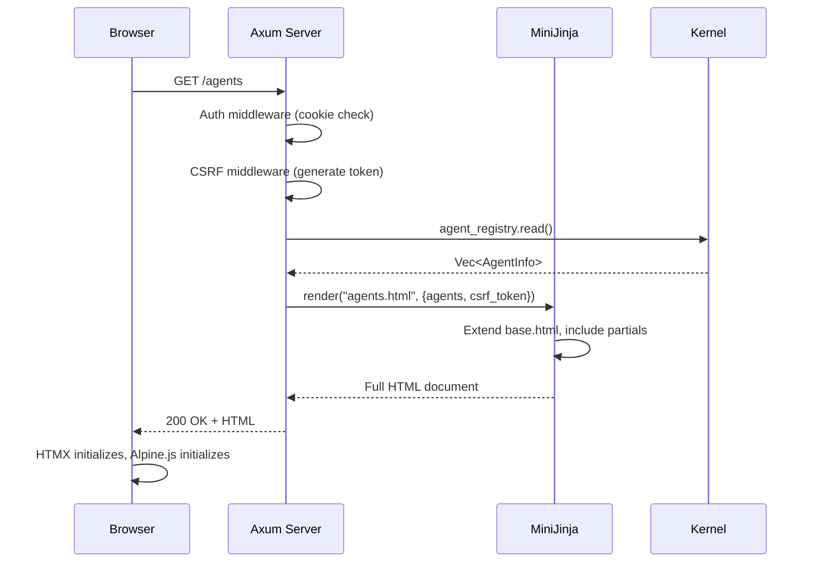
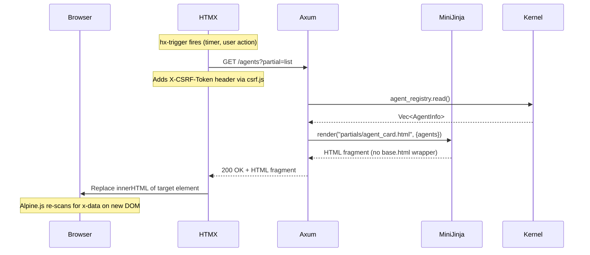
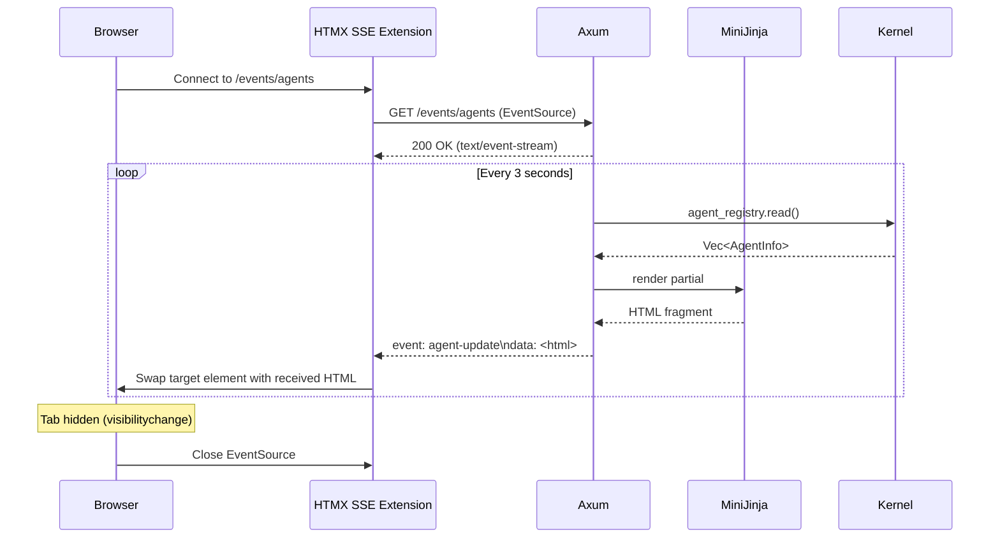
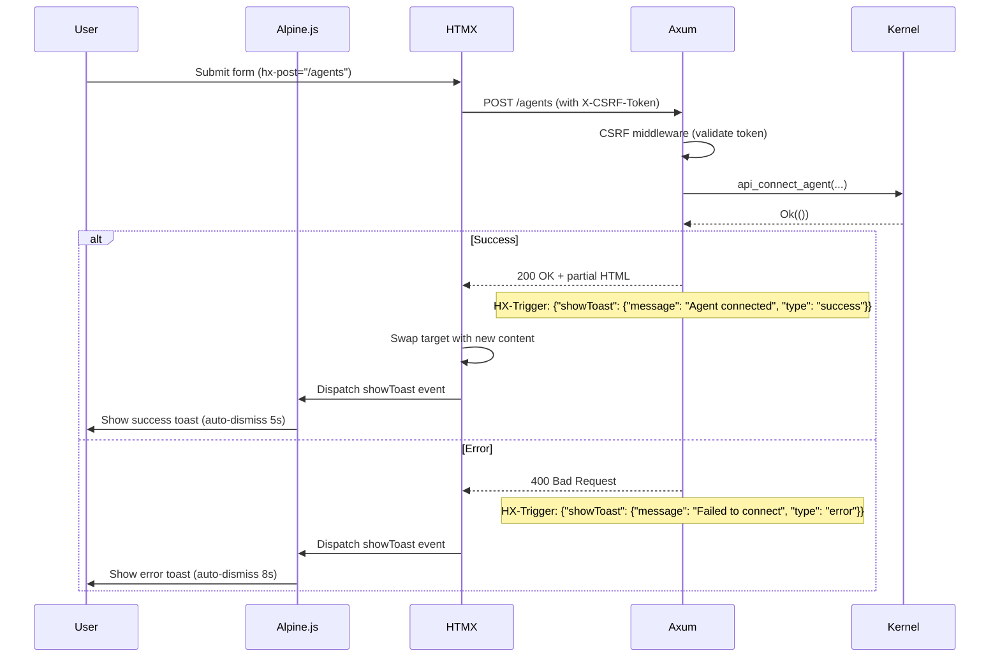

# WebUI Redesign Data Flow

> How data flows from the Axum server through HTMX partials and SSE streams to update the browser UI.

---

## Full Page Load Flow



## HTMX Partial Swap Flow



## SSE Live Update Flow (new)



## Form Submission with Toast Flow (new)



## Template Rendering Architecture

```
base.html
  +-- Topbar partial (partials/topbar.html)
  +-- Sidebar partial (partials/sidebar.html)
  +-- Toast container (partials/toast_container.html)
  +-- 
       |
       +-- dashboard.html
       |     +-- partials/dashboard_stats.html (HTMX swap target)
       |     +-- partials/dashboard_recent_audit.html (HTMX swap target)
       |
       +-- agents.html
       |     +-- partials/agent_card.html (HTMX swap target)
       |     +-- partials/empty_state.html (when no agents)
       |
       +-- tasks.html
       |     +-- partials/task_row.html (HTMX swap target)
       |     +-- partials/empty_state.html (when no tasks)
       |
       +-- task_detail.html
       |     +-- (inline SSE log terminal, already exists)
       |
       +-- tools.html
       |     +-- partials/tool_card.html (HTMX swap target)
       |     +-- partials/empty_state.html (when no tools)
       |
       +-- secrets.html
       |     +-- partials/secret_row.html (HTMX swap target)
       |     +-- partials/empty_state.html (when no secrets)
       |
       +-- pipelines.html
       |     +-- partials/pipeline_row.html (HTMX swap target)
       |     +-- partials/empty_state.html (when no pipelines)
       |
       +-- audit.html
             +-- partials/log_line.html (HTMX swap target)
             +-- partials/audit_filters.html (filter bar)
```

---

## Data Sources by Page

| Page | Kernel Data Source | Refresh Mechanism | Current | Target |
|------|-------------------|-------------------|---------|--------|
| Dashboard | `agent_registry`, `scheduler`, `tool_registry`, `audit`, `background_pool` | Full page load | Polling (5s via HTMX on audit table only) | SSE for stats + recent audit |
| Agents | `agent_registry.list_online()` | `?partial=list` | Polling 5s | SSE `agent-update` events |
| Tasks | `scheduler.list_tasks()` | `?partial=list` | Polling 3s | SSE `task-update` events |
| Task Detail | `scheduler.get_task()`, `audit.query_since_for_task()` | SSE (already) | SSE (done) | Keep as-is |
| Tools | `tool_registry.list_all()` | `?partial=list` | Polling 10s | Keep polling (tools change rarely) |
| Secrets | `vault.list()` | `?partial=list` | Polling 10s | Keep polling (secrets change rarely) |
| Pipelines | `pipeline_engine.store_arc().list_pipelines()` | `?partial=list` | Polling 10s | Keep polling (pipelines change rarely) |
| Audit | `audit.query_recent()`, `audit.count()` | `?partial=list` | Polling 10s | SSE `audit-entry` events |

---

## Related

- [[WebUI Redesign Plan]]
- [[WebUI Redesign Research]]
