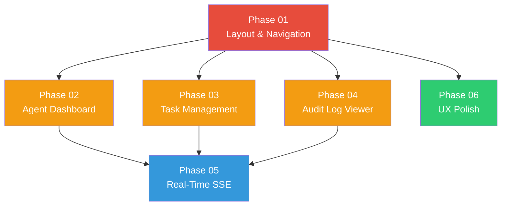

# WebUI Redesign Plan

> Transform the AgentOS web dashboard from a functional prototype into a polished, seamless, interactive management console using Axum + HTMX + Alpine.js + Pico CSS.

---

## Why This Matters

The web UI is the primary visual interface for monitoring and managing AgentOS. The current implementation is functional -- every section (Dashboard, Agents, Tasks, Tools, Secrets, Pipelines, Audit) renders data and supports CRUD operations via HTMX partials. However, the UI lacks the polish, interactivity, and feedback mechanisms needed for a production-quality management console:

- **No sidebar/responsive layout** -- the nav is a flat horizontal bar that does not scale to small screens
- **No empty states** -- pages with no data show blank tables/grids
- **No loading indicators** -- HTMX swaps happen silently with no visual feedback
- **No toast notifications** -- success/error feedback requires page redirects
- **No SSE for dashboard/agents** -- only the task detail log stream uses SSE; everything else polls
- **No keyboard shortcuts** -- no way to navigate between sections without a mouse
- **No search on tasks/agents** -- the audit log has filtering but tasks and agents do not
- **Dashboard is barebones** -- just four number cards and a recent audit table

## Current State

| Component | Current State | Issues |
|-----------|--------------|--------|
| Layout (`base.html`) | Horizontal nav bar, `<main class="container">`, minimal footer | No sidebar, no responsive collapse, no breadcrumbs |
| Dashboard (`dashboard.html`) | 4 stat cards (uptime, agents, tasks, tools) + recent audit table | No charts, no agent status breakdown, no quick actions |
| Agent Manager (`agents.html`) | Grid of article cards, Alpine modal for connect, 5s polling | No search/filter, no status indicators, no empty state |
| Task Inspector (`tasks.html`) | Table with clickable rows, 3s polling | No search, no status filter, no create/cancel, no empty state |
| Task Detail (`task_detail.html`) | Detail cards + context window + SSE log terminal | Good -- SSE works, log terminal is styled, but no cancel button |
| Tool Manager (`tools.html`) | Grid of article cards, type filter, install form | No trust tier badges, no permission details, no empty state |
| Secrets (`secrets.html`) | Table with add/revoke, Alpine modal | No empty state, no scope filter |
| Pipelines (`pipelines.html`) | Table with run button, Alpine modal | No run status tracking, no empty state |
| Audit Log (`audit.html`) | Table with event_type filter + limit selector + 10s polling | No severity filter, no date range, no live SSE stream |
| CSS (`app.css`) | ~227 lines of custom styles on top of Pico CSS | Well-structured but no sidebar, no skeleton loader, no toast styles |
| JS | `csrf.js` (8 lines), `htmx.min.js`, `alpine.min.js` | No custom JS utilities, no keyboard shortcut handler |

## Target Architecture

```
base.html (shell)
+---------------------------------------------------------------+
| Topbar: [Logo] [Breadcrumbs...] [Search] [Status Dot] [Theme] |
+--------+------------------------------------------------------+
| Sidebar| Main Content Area                                     |
| - Dash | +--------------------------------------------------+ |
| - Agent| | Page Header + Actions                             | |
| - Tasks| +--------------------------------------------------+ |
| - Tools| | Content (tables, cards, forms)                    | |
| - Secrt| | - HTMX partial swap targets                       | |
| - Pipes| | - Empty states when no data                       | |
| - Audit| | - Skeleton loaders during fetch                   | |
|        | +--------------------------------------------------+ |
+--------+------------------------------------------------------+
| Toast container (fixed bottom-right, Alpine.js managed)        |
+---------------------------------------------------------------+
```

### Technology Stack (unchanged)

- **Axum** -- HTTP server, SSE endpoints, middleware
- **HTMX** -- server-driven partial swaps (`hx-get`, `hx-swap`, `hx-trigger`)
- **Alpine.js** -- client-side UI state (modals, dropdowns, toasts, theme toggle)
- **Pico CSS v2.1.1** -- semantic HTML styling via CSS custom properties
- **MiniJinja** -- server-side template rendering with auto-escaping

---

## Phase Overview

| Phase | Name | Effort | Dependencies | Link | Status |
|-------|------|--------|--------------|------|--------|
| 01 | Layout and Navigation Shell | 2d | None | [[01-layout-navigation]] | partial |
| 02 | Agent Dashboard Enhancement | 2d | Phase 01 | [[02-agent-dashboard]] | partial |
| 03 | Task Management Enhancement | 2d | Phase 01 | [[03-task-management]] | planned |
| 04 | Audit Log Viewer Enhancement | 2d | Phase 01 | [[04-audit-log-viewer]] | planned |
| 05 | Real-Time Updates via SSE | 2d | Phases 02, 03, 04 | [[05-real-time-updates]] | planned |
| 06 | UX Polish: Empty States, Skeletons, Toasts, and Accessibility | 2d | Phase 01 | [[06-ux-polish]] | planned |

---

## Phase Dependency Graph



**Execution order:** Phase 01 first (foundation), then Phases 02/03/04/06 in parallel (all depend only on 01), then Phase 05 last (depends on 02/03/04 being in place).

---

## Key Design Decisions

1. **Pico CSS only, extended via custom properties.** No additional CSS frameworks. All customization uses `--pico-*` custom properties and targeted CSS rules in `app.css`. This keeps the bundle small and avoids class-name bloat.

2. **Sidebar navigation over horizontal topbar.** A sidebar provides clearer section hierarchy, room for icons, and better responsiveness (collapses to hamburger on mobile). The topbar becomes a thin bar with breadcrumbs and global actions.

3. **HTMX for all data fetching, no JSON APIs.** Every dynamic update returns rendered HTML fragments. This maintains progressive enhancement (pages work without JS) and keeps the frontend simple.

4. **SSE for live updates instead of WebSockets.** SSE is simpler, unidirectional (server-to-client), works through proxies, and HTMX has native SSE support via `hx-ext="sse"`. One SSE endpoint per domain (agents, tasks, audit) multiplexes relevant events.

5. **Alpine.js for ephemeral client-side state only.** Alpine handles modals, dropdowns, toast lifecycle, theme toggle, and keyboard shortcuts. It never fetches data or manages server state.

6. **Toast notifications over page redirects.** All form submissions use HTMX with `hx-swap` targeting specific containers. Success/error feedback is shown via Alpine-managed toast popups using HTMX response headers (`HX-Trigger`).

7. **Skeleton loaders over spinners.** Skeleton placeholders (pulsing gray rectangles matching content layout) provide better perceived performance than spinners. Implemented via the `htmx:beforeRequest` / `htmx:afterRequest` events.

8. **Progressive enhancement is mandatory.** Every page must be fully functional with JavaScript disabled. HTMX and Alpine enhance the experience but are not required for basic read/write operations.

---

## Risks

| Risk | Impact | Mitigation |
|------|--------|------------|
| Pico CSS sidebar conflicts | Medium | Use CSS Grid for the shell layout; Pico's `container` class only inside main content area |
| SSE connection limits (6 per browser) | Medium | Single multiplexed SSE endpoint per page, not per component; auto-close when tab loses focus |
| HTMX + Alpine.js interaction bugs | Low | Keep Alpine data scoped to individual components; use `htmx:afterSwap` to reinitialize Alpine on swapped content |
| Template bloat from partials | Low | Extract shared fragments (empty state, skeleton, toast) into MiniJinja include partials |
| CSP conflicts with inline scripts | Medium | Current CSP does not allow `'unsafe-inline'` for scripts; all new JS goes in external files |
| Mobile responsiveness regressions | Medium | Test with browser devtools at 375px, 768px, 1024px breakpoints before merging each phase |

---

## Related

- [[WebUI Redesign Research]]
- [[WebUI Redesign Data Flow]]
- [[25-WebUI Redesign]]
- [[23-WebUI Security Fixes]]
