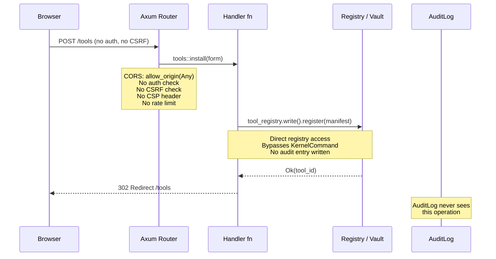
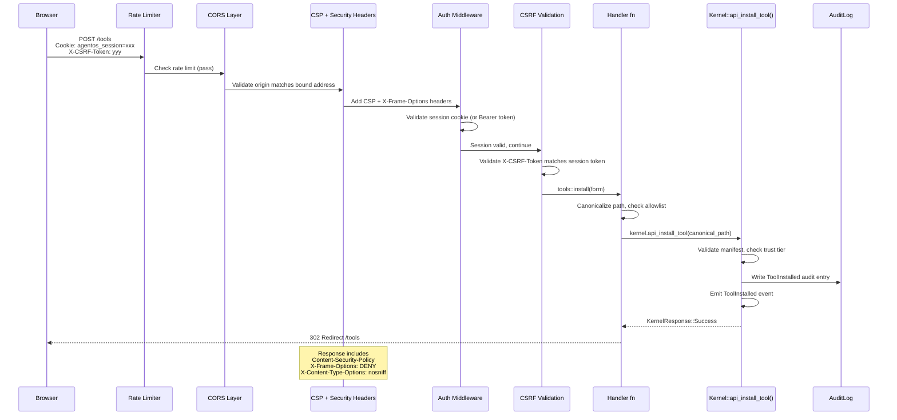
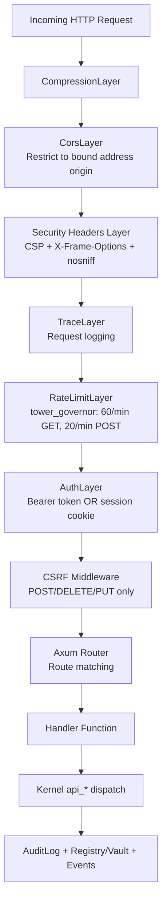
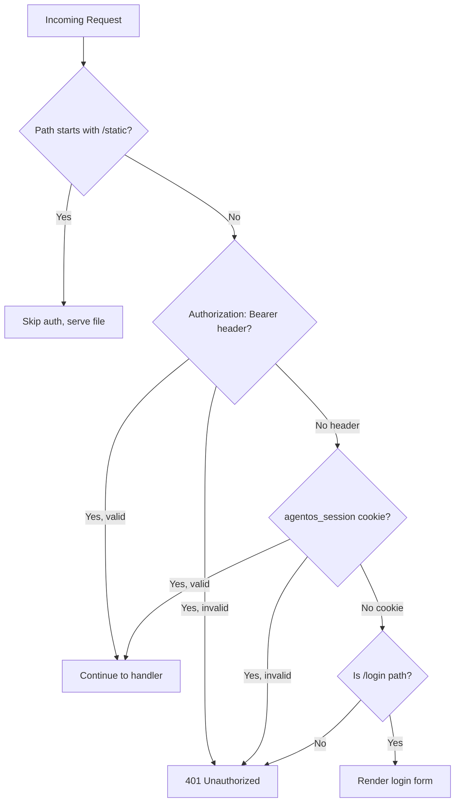

# WebUI Security Fixes Data Flow

> Shows how HTTP requests flow through the `agentos-web` crate before and after the security fixes, covering the middleware stack, secrets handling, and SSE stream redesign.

---

## Current (Insecure) Request Flow



### Problems in Current Flow

1. **No authentication** -- any network client can call any endpoint
2. **No CSRF token** -- a malicious page can submit forms on behalf of a browser user
3. **CORS allows any origin** -- browser same-origin policy is defeated
4. **Handlers call registries directly** -- the kernel command dispatch (and its audit logging, capability checking, event emission) is bypassed
5. **No Content-Security-Policy** -- inline script injection possible
6. **No rate limiting** -- automated abuse and DoS possible
7. **Secrets flow as plain `String`** -- never zeroized in memory after use

---

## Target (Secured) Request Flow



---

## Middleware Stack (Outside-In)

The order of middleware layers matters. Each layer processes the request before passing it inward, and processes the response on the way back out.



**Layer ordering rationale:**
- CORS rejects disallowed origins before any request processing
- Rate limiting happens before expensive auth validation
- Auth validates identity before CSRF checks
- CSRF only applies to state-changing methods (POST/DELETE/PUT)
- Static files (`/static/*`) bypass auth and CSRF

---

## Authentication Dual-Mode Flow



---

## Secrets Data Flow (Before vs After)

### Before (C5 vulnerability)

```
Browser form POST
    |
    v
Handler receives CreateForm { name: String, value: String, scope: Option<String> }
    |
    | form.value: String -- plain heap allocation
    | Never zeroized
    |
    v
vault.set(&form.name, &form.value, SecretOwner::Kernel, SecretScope::Global)
    |
    | Vault encrypts internally
    |
    v
Handler returns Response
    |
    | form is dropped -- String deallocated but memory NOT zeroed
    | Secret bytes remain readable in freed heap until overwritten
```

### After (ZeroizingString)

```
Browser form POST
    |
    v
Handler receives CreateForm { name: String, value: String, scope: Option<String> }
    |
    | IMMEDIATELY: let secret_value = ZeroizingString::new(std::mem::take(&mut form.value))
    | form.value is now empty String
    | secret_value owns the original allocation
    |
    v
kernel.api_set_secret(form.name, secret_value.as_str(), scope, scope_raw)
    |
    | Kernel command handles audit logging + scope resolution
    |
    v
Handler returns Response
    |
    | secret_value dropped -> ZeroizingString::drop() zeros memory via Zeroize trait
    | No secret bytes remain in freed heap
```

---

## SSE Stream Fix (I1)

### Before (count-based tracking)

```
Client connects to /tasks/{id}/logs/stream
    |
    v
unfold(last_count = 0)
    |
    v  Every 1 second:
    audit.query_recent(50)   <-- returns 50 most recent entries ACROSS ALL TASKS
    |
    v
    Filter by task_id        <-- task-specific entries extracted
    relevant.len() = count
    |
    v
    if count > last_count:
        emit entries[last_count..]   <-- skip already-sent entries
        last_count = count
    else:
        emit keepalive

BUG 1: If total audit entries > 50, query_recent(50) window shifts.
        Task-specific entries fall off the window. count < last_count -> freeze.
BUG 2: If audit entries are deleted, relevant.len() drops.
        count < last_count -> stream freezes permanently.
BUG 3: If entries are added for OTHER tasks, window shifts and
        task-specific entries may be pushed out.
```

### After (ID-based tracking)

```
Client connects to /tasks/{id}/logs/stream
    |
    v
Parse task_id (return error event if invalid)
    |
    v
unfold(last_seen_id = 0)
    |
    v  Every 1 second:
    audit.query_since_for_task(task_id, last_seen_id, 100)
    |                          |
    |  SQL: WHERE task_id = ?1 AND rowid > ?2 ORDER BY rowid ASC LIMIT 100
    |
    v
    If entries returned:
        emit all entries
        last_seen_id = max(entry.rowid)
        Set SSE event id = last_seen_id  (enables client reconnection)
    else:
        emit keepalive comment

FIXED: rowid is monotonically increasing, never reused
FIXED: Query is task-specific, not a global window
FIXED: Deletions of old entries do not affect new delivery
FIXED: Client can reconnect with Last-Event-ID header
```

---

## Tool Install Path Security Flow (C6)

### Before

```
form.manifest_path = "/some/path/manifest.toml"
    |
    v
if path.contains("..") -> reject
    |  BUG: /etc/passwd passes (no "..")
    |  BUG: symlinks bypass string check
    |  BUG: absolute paths outside workspace accepted
    v
std::fs::read_to_string(path) -> parse TOML -> register
```

### After

```
form.manifest_path = "/some/path/manifest.toml"
    |
    v
std::fs::canonicalize(path)
    |  Resolves symlinks, "..", relative components
    |  Returns real absolute path
    v
canonical_path = "/real/resolved/path/manifest.toml"
    |
    v
Check canonical_path.starts_with(allowed_dir)
    |  allowed_dirs = [core_tools_dir, user_tools_dir] from config
    |  Each allowed_dir is also canonicalized
    |
    v  if not allowed:
    |      -> 403 Forbidden + audit SecurityViolation entry
    v  if allowed:
    Check extension == ".toml" (defense in depth)
    |
    v
kernel.api_install_tool(canonical_path)
    |  Trust tier validation + signing check + audit log
```

---

## Related

- [[WebUI Security Fixes Plan]] -- Master plan with all phases and design decisions
- [[23-WebUI Security Fixes]] -- Next-steps tracking entry
- [[22-Unwired Features]] -- Parent tracking issue
