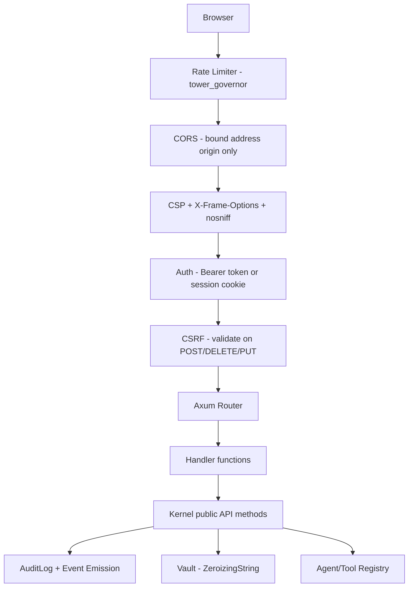
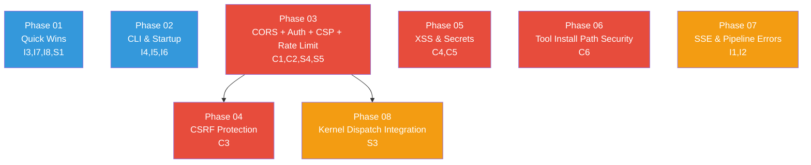

# WebUI Security Fixes Plan

> Fix 6 critical security vulnerabilities, 8 correctness bugs, and 5 architectural issues in the `agentos-web` crate and its CLI integration, discovered during code review.

---

## Why This Matters

The `agentos-web` crate exposes kernel operations over HTTP with **zero authentication, zero CSRF protection, and wide-open CORS**. Any process on the network can create agents, install tools, read secrets metadata, and modify kernel state. The SSE stream implementation loses events when more than 50 audit entries exist. Secret values pass through plain `String` (violating the project's `ZeroizingString` convention). The tool install endpoint reads arbitrary filesystem paths with only a trivially bypassable `..` check. These are not theoretical risks -- they are exploitable with a single `curl` command.

---

## Current State

| Area | Code Location | Status | Severity |
|------|---------------|--------|----------|
| CORS policy | `router.rs:35-40` | `allow_origin(Any)` -- any origin can call any endpoint | Critical |
| Authentication | all handlers | None -- all endpoints are publicly accessible | Critical |
| CSRF protection | all form handlers | None -- form POSTs have no token validation | Critical |
| XSS protection | `templates.rs`, `task_detail.html` | MiniJinja auto-escape on by default but never explicitly configured or tested | Critical |
| Secret handling | `secrets.rs:46` | `CreateForm.value` is plain `String`, not `ZeroizingString` | Critical |
| Tool install path | `tools.rs:64-108` | Reads arbitrary filesystem paths; `..` string check is bypassable via symlinks or absolute paths | Critical |
| SSE stream | `tasks.rs:91-138` | Count-based tracking (`last_count`) loses events when >50 exist; freezes if entries are deleted | High |
| Pipeline run error | `pipelines.rs:52-66` | Handler calls `kernel.run_pipeline()` but error is returned as raw `String`, not properly typed | Medium |
| `is_partial()` | `handlers/mod.rs:35-37` | Dead code, never called; implementation buggy (checks `"partial="` not `"partial=true"`) | Low |
| Vault passphrase | `web.rs:22,32` | `--vault-passphrase` CLI arg visible in `/proc/PID/cmdline`; not zeroized after use | High |
| Graceful shutdown | `web.rs:56-59` | `tokio::select!` drops losing branch without cleanup; kernel/server can orphan | High |
| Static file path | `router.rs:31` | `ServeDir::new("crates/agentos-web/static")` relative to CWD; breaks outside workspace | Medium |
| Audit limit | `audit.rs:18` | `query.limit.unwrap_or(50)` with no upper bound -- DoS via `?limit=999999999` | Medium |
| Secret scope | `secrets.rs:56-59` | Match arm `_ => SecretScope::Global` silently ignores all non-"global" scope values | Medium |
| Template duplication | all templates | Full pages and partials duplicate markup; no `` usage | Low |
| Kernel dispatch bypass | `agents.rs:86,98`, `tools.rs:64-108` | Agent connect/disconnect and tool install/remove bypass kernel command dispatch, skipping audit log | High |
| No CSP header | `router.rs` | Missing `Content-Security-Policy` header | Medium |
| No rate limiting | `router.rs` | All endpoints accept unbounded request volume | Medium |

---

## Target Architecture

After all 8 phases, the web crate will have:

- **Bearer token middleware** that rejects unauthenticated requests (configurable shared secret, printed at startup)
- **Session cookie auth** for browser/HTMX clients (set via `/login` endpoint)
- **CSRF tokens** embedded in all HTML forms, validated on POST/DELETE/PUT
- **Restrictive CORS** bound to the server's own origin only
- **Content-Security-Policy** header blocking inline scripts
- **Rate limiting** via `tower_governor` (60 req/min reads, 20 req/min mutations)
- **`ZeroizingString`** for secret values at the HTTP boundary
- **Path-allowlisted tool install** with `std::fs::canonicalize()` to prevent symlink/traversal bypass
- **Correct SSE stream** using monotonic row-ID-based tracking from the audit log
- **Graceful shutdown** wired through `CancellationToken` between kernel and server
- **All mutating handlers** routed through kernel command dispatch for audit trail consistency

---

## Phase Overview

| # | Phase | Issues Fixed | Effort | Priority | Dependencies | Detail |
|---|-------|-------------|--------|----------|--------------|--------|
| 01 | Quick wins and dead code | I3, I7, I8, S1 | 2h | high | None | [[01-quick-wins]] |
| 02 | CLI and startup fixes | I4, I5, I6 | 3h | high | None | [[02-cli-and-startup]] |
| 03 | CORS, Auth, CSP, Rate Limiting | C1, C2, S4, S5 | 6h | critical | None | [[03-cors-auth-csp-ratelimit]] |
| 04 | CSRF protection | C3 | 4h | critical | Phase 03 | [[04-csrf-protection]] |
| 05 | XSS hardening and secrets ZeroizingString | C4, C5 | 4h | critical | None | [[05-xss-and-secrets]] |
| 06 | Tool install path security | C6 | 3h | critical | None | [[06-tool-install-path-security]] |
| 07 | SSE stream fix and pipeline error handling | I1, I2 | 5h | high | None | [[07-sse-and-pipeline-execution]] |
| 08 | Kernel dispatch integration | S3 | 6h | high | Phase 03 | [[08-kernel-dispatch-integration]] |

**Total estimated effort: ~33 hours (~4-5 working days)**

---

## Phase Dependency Graph

Phases 01, 02, 03, 05, 06, 07 can start in parallel (no dependencies). Phase 04 requires Phase 03 (needs session infrastructure from auth middleware). Phase 08 requires Phase 03 (auth middleware must exist before restructuring handlers to use kernel dispatch).

---

## Key Design Decisions

1. **Shared-secret bearer token over mTLS.** The web UI is intended for single-operator use on localhost or a private network. A random 256-bit token generated at startup and printed to stdout is simpler and sufficient. mTLS would require certificate management infrastructure that is not warranted for a local admin UI.

2. **Session cookie for browser auth (dual-mode: bearer + cookie).** HTMX partial page updates are same-origin browser requests that do not naturally carry `Authorization` headers. A secure HTTP-only `SameSite=Strict` session cookie is the standard approach for browser-based auth. API clients (CLI, scripts) use bearer tokens. The middleware accepts either.

3. **CSRF via server-side session tokens, not double-submit cookies.** Double-submit cookies are weaker when CORS is misconfigured. Server-side tokens stored in a `DashMap<session_id, csrf_token>` are validated against the `X-CSRF-Token` header (for HTMX) or a hidden `_csrf` form field (for plain forms).

4. **Rate limiting via `tower_governor`.** It integrates natively with Tower/Axum middleware. Mutation endpoints (POST, DELETE) get stricter limits than read endpoints. SSE connections are excluded from rate limiting.

5. **Audit limit capped at 1,000 in the web handler.** The `AuditLog::query_recent(limit: u32)` method passes `limit` directly to `LIMIT ?1` in SQL. Capping at 1,000 in the handler prevents unbounded memory allocation. Power users who need more can use the CLI or query the SQLite audit DB directly.

6. **Tool install restricted to `core_tools_dir` and `user_tools_dir` from kernel config.** Rather than trying to sanitize arbitrary paths, the handler resolves the requested path via `std::fs::canonicalize()` (which resolves symlinks and `..`) and checks the result starts with an allowed directory prefix. This is a defense-in-depth layer on top of kernel dispatch.

7. **All mutating handlers route through kernel `api_*` public methods.** This ensures every state change is audit-logged, capability-checked, and event-emitted. The web layer becomes a thin HTTP adapter that translates form data to kernel calls and kernel responses to HTTP responses.

---

## Risks

| Risk | Impact | Mitigation |
|------|--------|------------|
| Auth token leak in server logs | Attacker gains full web UI access | Never log the token value; redact in tracing output |
| CSRF token storage adds server-side session state | Increases memory usage per session | Use `DashMap` with TTL cleanup; sessions expire after 8 hours |
| Rate limiting false positives | Legitimate admin locked out during rapid use | Set generous limits (60/min reads, 20/min mutations); admin can restart server |
| `ZeroizingString` API mismatch with `vault.set()` | `vault.set()` takes `&str`; need to ensure `ZeroizingString` is compatible | `ZeroizingString` is re-exported from `agentos-vault` and has `Deref<Target=str>` |
| Static file path via `CARGO_MANIFEST_DIR` breaks in release deployments | Binary relocated without source tree present | Add `[web] static_dir` config override; fallback to embedded static files |
| Kernel `cmd_*` methods are `pub(crate)` | Web crate cannot call them directly | Add `pub` wrapper methods (`api_*`) on `Kernel` that delegate to `cmd_*` |

---

## Related

- [[WebUI Security Fixes Data Flow]] -- Request flow through security middleware layers
- [[23-WebUI Security Fixes]] -- Next-steps tracking entry
- [[22-Unwired Features]] -- Parent tracking issue that identified web UI as disconnected
- [[12-Production Readiness Audit]] -- Deployment readiness context
