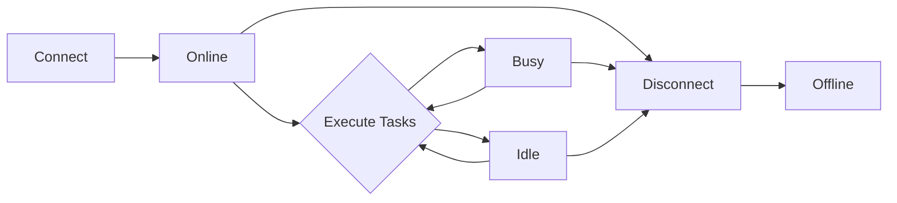

# Agent Management

> Agents are LLMs connected to the AgentOS kernel — each with a name, provider, model, cryptographic identity, permissions, and roles. This chapter covers the full agent lifecycle from connection through messaging to disconnection.

---

## What Is an Agent?

An agent in AgentOS is an LLM instance registered with the kernel. Each agent has:

- **Name** — a unique human-readable identifier (e.g., `"alice"`, `"code-reviewer"`)
- **Provider** — the LLM backend (`Ollama`, `OpenAI`, `Anthropic`, `Gemini`, or `Custom`)
- **Model** — the specific model to use (e.g., `llama3.2`, `gpt-4o`, `claude-sonnet-4-20250514`)
- **Status** — current state: `Online`, `Idle`, `Busy`, or `Offline`
- **Permissions** — a `PermissionSet` controlling what the agent can access
- **Roles** — one or more roles that grant additional permissions (every agent gets `base`)
- **Identity** — an Ed25519 keypair for cryptographic message signing
- **Current task** — the task the agent is currently executing, if any

Agents are defined by the `AgentProfile` struct in `crates/agentos-types/src/agent.rs`.

---

## Agent Lifecycle



1. **Connect** — register the agent with a provider, model, and name
2. **Online** — agent is ready to receive tasks and messages
3. **Busy** — agent is actively executing a task
4. **Idle** — agent is connected but not currently working
5. **Disconnect** — remove the agent from the kernel

---

## Connecting Agents

```bash
agentctl agent connect --provider <PROVIDER> --model <MODEL> --name <NAME> [--role <ROLE>...]
```

| Flag | Type | Required | Description |
|------|------|----------|-------------|
| `--provider` | `String` | Yes | LLM provider (see table below) |
| `--model` | `String` | Yes | Model name for the provider |
| `--name` | `String` | Yes | Unique agent display name |
| `--base_url` | `String` | No | Base URL for custom providers |
| `--role` | `String` (repeatable) | No | Roles to assign (default: `general`) |

### Supported Providers

| Provider | `--provider` value | API Key Env Var | Default Base URL |
|----------|-------------------|-----------------|------------------|
| Ollama | `ollama` | — (local) | `http://localhost:11434` |
| OpenAI | `openai` | `OPENAI_API_KEY` | `https://api.openai.com/v1` |
| Anthropic | `anthropic` | `ANTHROPIC_API_KEY` | `https://api.anthropic.com/v1` |
| Gemini | `gemini` | `GEMINI_API_KEY` | `https://generativelanguage.googleapis.com/v1beta` |
| Custom | `custom:<name>` | — | Must set `--base_url` |

### Examples

```bash
# Connect a local Ollama agent
agentctl agent connect --provider ollama --model llama3.2 --name "local-dev"

# Connect an OpenAI agent with the orchestrator role
agentctl agent connect --provider openai --model gpt-4o --name "planner" --role orchestrator

# Connect an Anthropic agent
agentctl agent connect --provider anthropic --model claude-sonnet-4-20250514 --name "code-reviewer"

# Connect a Gemini agent
agentctl agent connect --provider gemini --model gemini-pro --name "researcher"

# Connect a custom provider
agentctl agent connect --provider custom:local-llm --model my-model --name "custom-agent" \
  --base_url "http://localhost:8080/v1"

# Connect with multiple roles
agentctl agent connect --provider ollama --model llama3.2 --name "ops" \
  --role sysops --role security-monitor
```

### Available Roles

| Role | Description |
|------|-------------|
| `general` | Default role, basic permissions |
| `orchestrator` | Can delegate tasks to other agents |
| `security-monitor` | Access to security audit events |
| `sysops` | System operations access |
| `memory-manager` | Memory read/write access |
| `tool-manager` | Tool installation and management |

On connect, the kernel automatically:
1. Creates an `AgentProfile` with a unique `AgentID`
2. Assigns the `base` role (grants `fs.user_data` read/write)
3. Generates an Ed25519 keypair (private key stored in the vault)
4. Sets status to `Online`
5. Persists the agent to `agents.json`

---

## Listing Agents

```bash
agentctl agent list
```

Displays all connected agents in a table:

```
NAME            PROVIDER    MODEL              ID
local-dev       Ollama      llama3.2           a1b2c3d4-...
planner         OpenAI      gpt-4o             e5f6g7h8-...
code-reviewer   Anthropic   claude-sonnet-4-20250514   i9j0k1l2-...
```

---

## Disconnecting Agents

```bash
agentctl agent disconnect <NAME>
```

Removes the agent from the kernel registry. The agent's inbox is closed and any queued messages are lost.

**Example:**

```bash
agentctl agent disconnect "local-dev"
```

---

## Agent Messaging

Agents can communicate with each other through the kernel's message bus (`AgentMessageBus`). All messages are Ed25519-signed and have a configurable TTL (default: 60 seconds).

### Message Types

| Type | Description |
|------|-------------|
| `Text` | Plain text message |
| `Structured` | Arbitrary JSON payload |
| `TaskDelegation` | Delegate work with prompt, priority, and timeout |
| `TaskResult` | Return a task result with task ID and data |

### Sending a Direct Message

```bash
agentctl agent message --from <SENDER> <RECIPIENT> "<CONTENT>"
```

| Flag / Argument | Type | Required | Description |
|-----------------|------|----------|-------------|
| `--from` | `String` | Yes | Sender agent name |
| `to` | positional | Yes | Recipient agent name |
| `content` | positional | Yes | Message content |

**Example:**

```bash
agentctl agent message --from "planner" "code-reviewer" "Please review the auth module changes"
```

### Message Security

Every message delivered through the bus must pass two checks:

1. **Signature verification** — the sender's Ed25519 signature is verified against their registered public key. Messages with invalid or missing signatures are rejected.
2. **Expiration check** — messages past their `expires_at` timestamp are rejected before delivery. The default TTL is 60 seconds.

Failed deliveries emit a `MessageDeliveryFailed` notification for audit logging.

---

## Viewing Messages

```bash
agentctl agent messages <AGENT> [--last N]
```

| Flag | Type | Default | Description |
|------|------|---------|-------------|
| `agent` | positional | — | Agent name to view messages for |
| `--last` | `u32` | `10` | Number of recent messages to show |

Shows messages sent to and from the specified agent, with content type indicated:

```
[2026-03-16 14:30:01] planner -> code-reviewer: [Text] Please review the auth module changes
[2026-03-16 14:30:15] code-reviewer -> planner: [Text] LGTM, approved
[2026-03-16 14:31:00] planner -> ops: [TaskDelegation] Deploy auth module to staging (priority: 5, timeout: 300s)
```

**Example:**

```bash
# Show last 5 messages for the planner agent
agentctl agent messages planner --last 5
```

---

## Agent Groups

Groups allow broadcasting messages to multiple agents at once. Members are specified at group creation time.

### Creating a Group

```bash
agentctl agent group create <NAME> --members "<AGENT1,AGENT2,...>"
```

| Flag | Type | Required | Description |
|------|------|----------|-------------|
| `name` | positional | Yes | Group name |
| `--members` | `String` | Yes | Comma-separated agent names |

**Example:**

```bash
agentctl agent group create "dev-team" --members "planner,code-reviewer,local-dev"
```

### Broadcasting to a Group

```bash
agentctl agent broadcast --from <SENDER> <GROUP> "<CONTENT>"
```

| Flag | Type | Required | Description |
|------|------|----------|-------------|
| `--from` | `String` | Yes | Sender agent name |
| `group` | positional | Yes | Target group name |
| `content` | positional | Yes | Message content |

The broadcast is delivered to all group members except the sender. The response includes the number of recipients.

**Example:**

```bash
agentctl agent broadcast --from "planner" "dev-team" "Sprint review in 10 minutes"
# Output: Broadcast sent to 2 agents in group 'dev-team'
```

> [!note] Broadcast Scope
> A broadcast to a group only reaches members of that group. To broadcast to *all* connected agents regardless of group membership, the kernel uses the `Broadcast` message target internally — this is not directly exposed via CLI.

---

## Agent Identity

Every agent receives an Ed25519 cryptographic identity on connection. The private key is stored in the encrypted vault; the public key is registered with the message bus for signature verification.

### Viewing an Agent's Identity

```bash
agentctl identity show --agent <NAME>
```

Displays the agent's identity information:

```
Agent:        code-reviewer
Agent ID:     i9j0k1l2-...
Public Key:   a4f8e2d1c3b5...  (64 hex characters)
Has Signing Key: true
```

### Revoking an Agent's Identity

```bash
agentctl identity revoke --agent <NAME>
```

Removes the agent's signing key from the vault and revokes associated permissions. After revocation, the agent can no longer sign messages.

```bash
agentctl identity revoke --agent "code-reviewer"
# Output: Identity and permissions revoked for agent 'code-reviewer'.
```

> [!warning] Revocation Is Permanent
> Revoking an identity deletes the private key from the vault. The agent will need to be disconnected and reconnected to generate a new keypair.

---

## Permissions and Roles

Every agent has two sources of permissions:

1. **Direct permissions** — granted explicitly to the agent via `agentctl perm grant`
2. **Role permissions** — inherited from assigned roles

The kernel computes **effective permissions** by merging both sources. The `base` role is mandatory and grants `fs.user_data` read/write access to all agents.

For the full permission model — including capability tokens, deny entries, path-prefix matching, and SSRF blocking — see [[08-Security Model]].

### Quick Permission Examples

```bash
# Grant an agent file-read permission
agentctl perm grant local-dev fs.user_data:r

# Grant shell execution
agentctl perm grant ops shell.exec:x

# View an agent's effective permissions
agentctl perm show local-dev
```

---

## Agent Registry Persistence

The kernel persists agent state to disk in the configured data directory:

| File | Contents |
|------|----------|
| `agents.json` | All registered `AgentProfile` records |
| `roles.json` | All role definitions and permission sets |

These files are updated on every agent registration, status change, role assignment, or removal. On kernel restart, agents and roles are reloaded from these files.

---

## Summary

| Operation | Command | Key Behavior |
|-----------|---------|-------------|
| Connect | `agentctl agent connect --provider ... --model ... --name ...` | Creates profile, generates identity, assigns roles |
| List | `agentctl agent list` | Shows NAME, PROVIDER, MODEL, ID columns |
| Disconnect | `agentctl agent disconnect <name>` | Removes from registry, closes inbox |
| Message | `agentctl agent message --from ... <to> "..."` | Ed25519-signed, 60s TTL, audit logged |
| View Messages | `agentctl agent messages <agent> --last N` | Shows message history with types |
| Create Group | `agentctl agent group create <name> --members "a,b,c"` | Named group for broadcast |
| Broadcast | `agentctl agent broadcast --from ... <group> "..."` | Delivers to all group members except sender |
| Show Identity | `agentctl identity show --agent <name>` | Displays public key and signing status |
| Revoke Identity | `agentctl identity revoke --agent <name>` | Permanently removes signing key |
