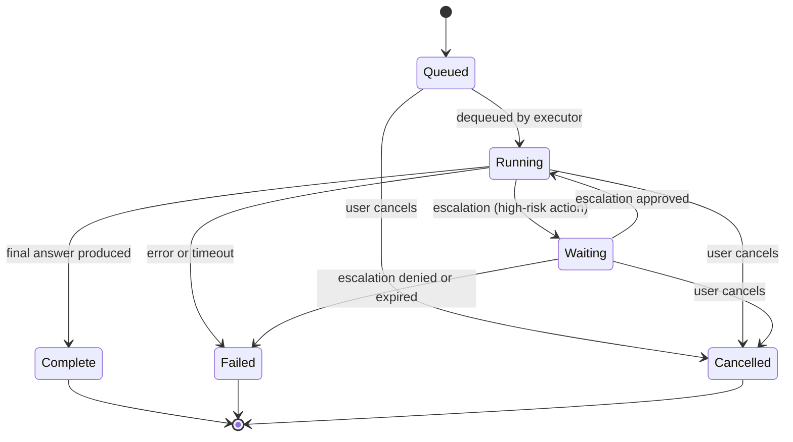

# Task System

> A task is a prompt sent to an agent for execution. The kernel manages task lifecycle, routing, tool calls, risk classification, escalation, budgets, and scheduling.

---

## What Is a Task?

A task represents a unit of work assigned to an agent. Each task has:

- **TaskID** — a unique UUID identifier
- **Original prompt** — the user's instruction text
- **State** — current lifecycle state (see below)
- **Agent** — the assigned agent (explicit or auto-routed)
- **Capability token** — HMAC-SHA256 signed token authorizing specific permissions
- **Priority** — 0–255, higher values are more urgent
- **Timeout** — maximum execution duration (default: 60 seconds, configurable)
- **History** — accumulated tool calls and results (`Vec<IntentMessage>`)
- **Parent task** — optional link to a parent task for delegation chains

Tasks are defined by the `AgentTask` struct in `crates/agentos-types/src/task.rs`.

---

## Task Lifecycle



| State | Description |
|-------|-------------|
| `Queued` | Task is in the priority queue waiting for an available executor slot |
| `Running` | Agent is actively executing — LLM inference and tool calls in progress |
| `Waiting` | Task paused pending human approval of a high-risk action (escalation) |
| `Complete` | Task finished successfully with a final answer |
| `Failed` | Task terminated due to error, timeout, budget exhaustion, or denied escalation |
| `Cancelled` | Task cancelled by user before completion |

State transitions are enforced by `TaskState::can_transition_to()` — invalid transitions are rejected.

---

## Creating Tasks

```bash
agentctl task run [--agent <NAME>] "<PROMPT>"
```

| Flag | Type | Required | Description |
|------|------|----------|-------------|
| `--agent` | `String` | No | Agent name to execute the task. If omitted, the router selects one automatically |
| `prompt` | positional | Yes | The task prompt |

**Examples:**

```bash
# Route automatically to the best available agent
agentctl task run "Summarize the contents of /data/report.csv"

# Assign to a specific agent
agentctl task run --agent "code-reviewer" "Review the authentication module for security issues"
```

When a task is created:
1. The kernel wraps the prompt in an `AgentTask` with a fresh `TaskID`
2. If `--agent` is specified, the task is assigned directly; otherwise the router selects an agent
3. The task enters the `Queued` state in the scheduler's priority queue
4. The task executor loop picks it up when a slot is available

---

## Task Routing

When no `--agent` is specified, the kernel's `TaskRouter` selects an agent using the configured strategy. Only agents with `Online` or `Idle` status are considered.

### Routing Strategies

| Strategy | `--strategy` value | Selection Logic |
|----------|-------------------|-----------------|
| **Capability-first** | `capability-first` | Pick the most capable model. Priority: Anthropic > OpenAI > Gemini > Custom > Ollama |
| **Cost-first** | `cost-first` | Pick the cheapest model. Priority: Ollama > Custom > Gemini > OpenAI > Anthropic |
| **Latency-first** | `latency-first` | Pick the fastest model. Priority: Ollama > Custom > Gemini > OpenAI > Anthropic |
| **Round-robin** | `round-robin` | Distribute tasks evenly across agents using an atomic counter |

The default strategy is **capability-first**.

### Routing Rules

Routing rules are evaluated before the strategy fallback. Each rule has a regex pattern matched against the task prompt, a preferred agent, and an optional fallback agent.

```toml
# Example routing rule configuration
[[routing.rules]]
task_pattern = "security|audit|vulnerability"
preferred_agent = "security-agent"
fallback_agent = "code-reviewer"

[[routing.rules]]
task_pattern = "deploy|staging|production"
preferred_agent = "ops"
```

Rules are evaluated in order. The first matching rule wins. If the preferred agent is offline, the fallback agent is tried. If no rules match, the strategy is applied.

---

## Task Execution Flow

The task executor loop runs continuously, polling every 100ms for queued tasks. When a slot is available (below `max_concurrent_tasks`), it dequeues the highest-priority task.

### Execution Steps

1. **Transition to Running** — set state, record `started_at` timestamp, emit `TaskStarted` event
2. **Context setup** — create context window with system prompt, tool descriptions, agent directory, and adaptive retrieval plan
3. **Injection scan** — scan the user prompt for injection patterns; high-confidence threats create an escalation
4. **LLM inference loop** (max 10 iterations):
   1. Compile context window with history, knowledge blocks, and budget state
   2. Check context utilization (warn at 80%, critical at 95%)
   3. Pre-inference budget check (skip if hard limit exceeded)
   4. Call LLM provider (`infer()`) — get response with token counts
   5. Record cost attribution audit event
   6. Post-inference budget enforcement (warnings, pauses, model downgrade)
   7. Parse tool calls from LLM output
   8. For each tool call:
      - Validate capability token and JSON schema
      - Check permissions (read/write/execute)
      - Run coherence checks (intent loops, write-without-read, scope escalation)
      - Classify risk level
      - If `HardApproval`: create escalation, transition to `Waiting`
      - Execute tool (sandboxed if configured)
      - Scan tool output for injection patterns
      - Push result back into context
   9. If no tool calls in the iteration → extract final answer
5. **Completion** — record result to episodic memory, emit `TaskCompleted` event, wake dependency waiters

---

## Tool Call Loop

When the LLM produces a tool call in its output, the kernel processes it through multiple validation layers:

### Layer A — Structural Validation

1. **Capability token** — verify the HMAC signature and that the token grants the required permission
2. **JSON schema** — validate the tool call arguments against the tool's input schema
3. **Permission check** — confirm the agent has read/write/execute access for the target resource

### Layer B — Semantic Coherence

1. **Intent loop detection** — 3+ consecutive identical tool calls (same tool + same payload) are rejected. 2 consecutive identical calls are flagged as suspicious.
2. **Write-without-read** — writing to a resource that was never read in the same task is flagged as suspicious (confidence: 0.5)
3. **Scope escalation** — using an intent type not in the agent's allowed set is flagged as suspicious (confidence: 0.8)

Suspicious actions are logged as warnings but allowed to proceed. Rejected actions return an error to the LLM.

---

## Risk Classification

Every tool call is classified by the `RiskClassifier` before execution. The classification determines whether the action proceeds automatically or requires human approval.

| Level | Name | Behavior | Examples |
|-------|------|----------|----------|
| 0 | **Autonomous** | Execute immediately | Read, Query, Observe, Escalate |
| 1 | **Notify** | Log and execute | Low-risk writes (temp dirs, scratchpad), Message, Broadcast, Subscribe |
| 2 | **SoftApproval** | Log warning, execute | File writes to `/home/`, `user_data`, `documents`; `email.draft`, `calendar`, `config` |
| 3 | **HardApproval** | Create escalation, pause task | Delegate, `email.send`, `deploy`, `publish`, `delete`, `payment`, `agent.spawn` |
| 4 | **Forbidden** | Reject immediately | Writes to `/etc/`, `/sys/`, `/proc/`; `capability.self-escalate`, `secret.read-raw` |

### Escalation-Triggered Pausing

When a tool call is classified as `HardApproval` (Level 3):

1. The kernel creates a `PendingEscalation` with details of the action
2. The task transitions from `Running` to `Waiting`
3. The escalation has a 5-minute expiration window
4. A human operator must resolve via `agentctl escalation resolve`
5. On approval: task resumes from `Waiting` to `Running`
6. On denial or expiration: task transitions to `Failed`

```bash
# List pending escalations
agentctl escalation list

# Approve an escalation
agentctl escalation resolve <ESCALATION_ID> --decision "Approved"

# Deny an escalation
agentctl escalation resolve <ESCALATION_ID> --decision "Denied"
```

---

## Listing Tasks

```bash
agentctl task list
```

Displays all tasks in a table:

```
TASK ID                              STATE       AGENT           PROMPT
a1b2c3d4-e5f6-7890-abcd-ef1234567890 Running     code-reviewer   Review the authentication module...
f0e1d2c3-b4a5-6789-0abc-def123456789 Complete    local-dev       Summarize the contents of /data/...
```

The `TaskSummary` includes: `id`, `state`, `agent_id`, `prompt_preview` (first 100 characters), `created_at`, `tool_calls` count, and `tokens_used`.

---

## Task Logs

```bash
agentctl task logs <TASK_ID>
```

Shows the execution log for a specific task, including tool calls, LLM responses, and state transitions.

**Example:**

```bash
agentctl task logs a1b2c3d4-e5f6-7890-abcd-ef1234567890
```

---

## Cancelling Tasks

```bash
agentctl task cancel <TASK_ID>
```

Transitions the task to `Cancelled` state. Only tasks in `Queued`, `Running`, or `Waiting` states can be cancelled.

**Example:**

```bash
agentctl task cancel a1b2c3d4-e5f6-7890-abcd-ef1234567890
```

---

## Background Tasks

Background tasks run detached from the CLI session. Use the `bg` command group to manage them.

### Running a Background Task

```bash
agentctl bg run --name <NAME> --agent <AGENT> --task "<PROMPT>" [--detach]
```

| Flag | Type | Default | Description |
|------|------|---------|-------------|
| `--name` | `String` | — | Unique name for the background task |
| `--agent` | `String` | — | Agent to execute the task |
| `--task` | `String` | — | Task prompt |
| `--detach` | flag | `false` | Return immediately without waiting for output |

**Example:**

```bash
# Run a background task and detach
agentctl bg run --name "nightly-audit" --agent "ops" --task "Run full security audit" --detach

# Run and stay attached (see output)
agentctl bg run --name "data-export" --agent "local-dev" --task "Export user data to CSV"
```

### Listing Background Tasks

```bash
agentctl bg list
```

Shows all background tasks with their name, agent, state, start time, and completion time.

### Viewing Background Task Logs

```bash
agentctl bg logs <NAME> [--follow]
```

| Flag | Type | Default | Description |
|------|------|---------|-------------|
| `name` | positional | — | Background task name |
| `--follow` | flag | `false` | Stream logs in real-time (like `tail -f`) |

**Example:**

```bash
agentctl bg logs "nightly-audit" --follow
```

### Killing a Background Task

```bash
agentctl bg kill <NAME>
```

Terminates a running background task by name.

---

## Scheduled Tasks

Scheduled tasks run on a cron schedule. The kernel evaluates cron expressions and spawns tasks at the specified times.

### Creating a Scheduled Task

```bash
agentctl schedule create --name <NAME> --cron "<EXPRESSION>" --agent <AGENT> \
  --task "<PROMPT>" --permissions "<PERM1,PERM2,...>"
```

| Flag | Type | Required | Description |
|------|------|----------|-------------|
| `--name` | `String` | Yes | Unique schedule name |
| `--cron` | `String` | Yes | Cron expression (5-field standard format) |
| `--agent` | `String` | Yes | Agent to execute the task |
| `--task` | `String` | Yes | Task prompt |
| `--permissions` | `String` | Yes | Comma-separated permissions for the task |

#### Cron Expression Format

```
┌───────────── minute (0-59)
│ ┌───────────── hour (0-23)
│ │ ┌───────────── day of month (1-31)
│ │ │ ┌───────────── month (1-12)
│ │ │ │ ┌───────────── day of week (0-6, Sunday=0)
│ │ │ │ │
* * * * *
```

**Examples:**

```bash
# Run every day at 2 AM
agentctl schedule create --name "daily-report" --cron "0 2 * * *" \
  --agent "ops" --task "Generate daily system health report" \
  --permissions "fs.read,audit.read"

# Run every Monday at 9 AM
agentctl schedule create --name "weekly-review" --cron "0 9 * * 1" \
  --agent "code-reviewer" --task "Review code changes from last week" \
  --permissions "fs.read"

# Run every 15 minutes
agentctl schedule create --name "health-check" --cron "*/15 * * * *" \
  --agent "ops" --task "Check system health" \
  --permissions "fs.read,shell.exec"
```

### Listing Scheduled Tasks

```bash
agentctl schedule list
```

Shows all schedules with name, cron expression, agent, state, next run time, and run count.

### Pausing a Schedule

```bash
agentctl schedule pause <NAME>
```

Suspends a scheduled task. It will not run until resumed.

### Resuming a Schedule

```bash
agentctl schedule resume <NAME>
```

Re-activates a paused schedule.

### Deleting a Schedule

```bash
agentctl schedule delete <NAME>
```

Permanently removes a scheduled task.

---

## Task Timeouts

Tasks have a configurable timeout. If a task exceeds its timeout, it transitions to `Failed`.

| Config Key | Default | Description |
|------------|---------|-------------|
| `[kernel].default_task_timeout_secs` | `60` | Default timeout for all tasks (seconds) |

The effective timeout is multiplied by the task's `PreemptionLevel`:

| Preemption Level | Multiplier | Effective Timeout (at default 60s) |
|-----------------|------------|-------------------------------------|
| `Low` | 1x | 60 seconds |
| `Normal` | 2x | 120 seconds |
| `High` | 3x | 180 seconds |

The scheduler's `check_timeouts()` method sweeps for timed-out tasks and marks them `Failed` with a `TimedOutTask` record.

---

## Concurrent Task Limits

The kernel limits the number of simultaneously running tasks.

| Config Key | Default | Description |
|------------|---------|-------------|
| `[kernel].max_concurrent_tasks` | `4` | Maximum parallel tasks |

When the limit is reached, new tasks remain `Queued` until a running task completes. Tasks are dequeued in priority order (highest priority first; FIFO within the same priority).

---

## Task Budgets

Each agent can have resource budgets that limit token usage, cost, and tool calls per day.

| Budget Field | Default | Description |
|-------------|---------|-------------|
| `max_tokens_per_day` | `500,000` | Maximum tokens per day (0 = unlimited) |
| `max_cost_usd_per_day` | `$5.00` | Maximum cost per day (0 = unlimited) |
| `max_tool_calls_per_day` | `200` | Maximum tool calls per day (0 = unlimited) |
| `warn_at_pct` | `80%` | Emit warning at this utilization |
| `pause_at_pct` | `95%` | Pause task at this utilization |
| `on_hard_limit` | `Suspend` | Action on 100%: `Suspend`, `NotifyOnly`, or `Kill` |

When a budget threshold is hit:

- **Warning (80%)** — log a warning, continue execution
- **Pause (95%)** — attempt model downgrade if configured, otherwise pause
- **Hard limit (100%)** — `Suspend` pauses the task, `Kill` terminates it, `NotifyOnly` alerts only

---

## Task Dependencies

Tasks can form dependency chains through delegation. The kernel maintains a `TaskDependencyGraph` that:

- Prevents circular dependencies via DFS cycle detection
- Tracks parent-child relationships between delegated tasks
- Automatically requeues waiting parent tasks when child tasks complete

```bash
# A parent task might delegate to a child via TaskDelegation message
# The kernel tracks: parent task waits on child task
# When child completes, parent is requeued to continue
```

---

## Summary

| Operation | Command | Key Behavior |
|-----------|---------|-------------|
| Run task | `agentctl task run [--agent name] "prompt"` | Auto-routes if no agent specified |
| List tasks | `agentctl task list` | Shows ID, state, agent, prompt preview |
| View logs | `agentctl task logs <id>` | Execution history and tool calls |
| Cancel task | `agentctl task cancel <id>` | Transitions to Cancelled state |
| Background run | `agentctl bg run --name ... --agent ... --task ...` | Detached execution |
| Background list | `agentctl bg list` | Shows all background tasks |
| Background logs | `agentctl bg logs <name> [--follow]` | Stream execution output |
| Background kill | `agentctl bg kill <name>` | Terminate background task |
| Schedule create | `agentctl schedule create --name ... --cron ... --agent ... --task ...` | Cron-based scheduling |
| Schedule list | `agentctl schedule list` | Shows schedules with next run time |
| Schedule pause | `agentctl schedule pause <name>` | Suspend schedule |
| Schedule resume | `agentctl schedule resume <name>` | Re-activate schedule |
| Schedule delete | `agentctl schedule delete <name>` | Remove schedule |
