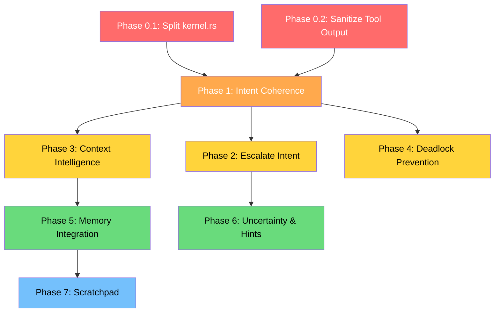

# Feedback Implementation Plan

> Implementation plan derived from [[agentos-feedback-and-guidance]] — prioritized by impact, grounded in actual codebase state as of 2026-03-10.

---

## Current Codebase Assessment

Before planning changes, here is what **actually exists** versus what the feedback assumes:

| Area | Feedback Assumption | Actual State |
|---|---|---|
| Context management | Only token-count eviction | Three strategies exist (`FifoEviction`, `Summarize`, `SlidingWindow`) but none are semantically aware — no importance scoring, no pinning, no `last_accessed` tracking |
| Memory architecture | "Least defined" | `EpisodicStore` (SQLite + FTS5) and `SemanticStore` (SQLite + fastembed vectors + RRF hybrid search) are **fully implemented** — but the kernel doesn't auto-inject past episodes at task start |
| Agent identity | Ephemeral, regenerated on restart | `AgentRegistry` persists to disk (`agents.json`/`roles.json`) and `AgentID` is a stable UUID — but there's no identity key in vault, no `restart_count`, no `capability_profile` persistence |
| Intent system | Six intent types | Correct — `Read`, `Write`, `Execute`, `Query`, `Observe`, `Delegate`. Missing: `Message`, `Broadcast`, `Escalate` |
| Deadlock detection | Not implemented | Confirmed — `TaskScheduler` is a pure priority `BinaryHeap` with no dependency graph |
| Kernel modularity | N/A (feedback reviewed spec) | `kernel.rs` is 2,730 lines — already identified as H-1 in `08-improvements-and-issues.md` |
| Tool output sanitization | Praised as implemented | Tool results are pushed into context as raw JSON — **no sanitization layer exists** |

---

## Phase 0 — Structural Prerequisites

> These must happen first. Every subsequent phase builds on this foundation.

### 0.1 Split `kernel.rs` into Focused Modules

**Why first:** The monolithic kernel blocks safe modification. Every change in Phases 1-4 touches the kernel. Splitting it is a prerequisite for parallel development.

**Affected files:**
- `crates/agentos-kernel/src/kernel.rs` (2,730 lines)

**Target structure:**
```
crates/agentos-kernel/src/
├── kernel.rs              # Struct def + boot() only (~200 lines)
├── run_loop.rs            # Already exists — main async loop
├── task_executor.rs       # Already exists — task execution
├── kernel_action.rs       # Already exists — kernel action dispatch
├── commands/
│   ├── mod.rs             # Already exists with agent/task/tool/etc.
│   └── ...
├── intent_validator.rs    # NEW — extract validate_tool_call + add coherence
├── context_injector.rs    # NEW — pre-task context assembly (system prompt, agent dir, episodic recall)
└── task_completion.rs     # NEW — post-task cleanup, episodic summary write
```

**What moves where:**
- `boot()` stays in `kernel.rs`
- `execute_task_sync()` context assembly (lines ~97-158 in task_executor.rs) → `context_injector.rs`
- `validate_tool_call()` → `intent_validator.rs`
- All 40+ `cmd_*` handlers already in `commands/` — verified complete

**Effort:** ~4 hours. Pure refactor, no behavior change. Tests must still pass.

---

### 0.2 Add Tool Output Sanitization Layer

**Why:** The feedback correctly identifies raw tool output as the primary prompt injection vector. Currently, `push_tool_result()` in `context.rs` wraps results in a `[ToolResult]` role marker but does **no content sanitization**.

**Affected files:**
- `crates/agentos-kernel/src/context.rs` — `push_tool_result()`
- `crates/agentos-kernel/src/task_executor.rs` — where tool results enter context

**Implementation:**
```rust
// New: crates/agentos-kernel/src/sanitizer.rs
pub fn sanitize_tool_output(tool_name: &str, raw: &serde_json::Value) -> String {
    let text = raw.to_string();
    // 1. Wrap in typed delimiters
    let wrapped = format!(
        "[TOOL_OUTPUT:{}]\n{}\n[/TOOL_OUTPUT:{}]",
        tool_name, text, tool_name
    );
    // 2. Strip any instruction-like patterns from tool output
    //    (e.g., "ignore previous instructions", "you are now...")
    // 3. Truncate oversized outputs to configurable max_tool_output_tokens
    wrapped
}
```

**Effort:** ~2 hours. Critical security fix.

---

## Phase 1 — Intent Coherence & Semantic Validation

> The highest-impact feedback item. Catches prompt injection, confused-deputy attacks, and model-specific failure modes.

### 1.1 Add `IntentCoherenceResult` Type

**File:** `crates/agentos-types/src/intent.rs`

```rust
// Add after IntentResultStatus
#[derive(Debug, Clone, Serialize, Deserialize)]
pub enum IntentCoherenceResult {
    Approved,
    Suspicious { reason: String, confidence: f32 },
    Rejected { reason: String },
}
```

### 1.2 Build Intent Coherence Checker

**New file:** `crates/agentos-kernel/src/intent_validator.rs`

This module replaces the current `validate_tool_call()` in `task_executor.rs` with a two-layer pipeline:

**Layer A — Structural (already exists):**
- Capability token validation via `capability_engine.validate_intent()`
- JSON Schema validation via `schema_registry.validate()`
- Permission checking via `tool_runner.get_required_permissions()`

**Layer B — Semantic (new):**
| Rule | Detection | Response |
|---|---|---|
| Write-without-read | Agent calls `Write` on a resource it never `Read` in this task | `Suspicious` |
| Intent loop | Same tool + same payload 3+ times in a row | `Rejected` — "Looping detected" |
| Scope escalation | Agent targets a tool not in its original task description | `Suspicious` |
| Cross-task reference | Agent references a `TaskID` or `AgentID` not in its context | `Rejected` |

**How it works in the execution loop:**
```
task_executor.rs:
  1. Parse tool call
  2. Layer A: validate_structural() → pass/fail
  3. Layer B: validate_coherence(task, tool_call, context_history) → Approved/Suspicious/Rejected
  4. If Suspicious → audit log + proceed (configurable: block or warn)
  5. If Rejected → return error to agent with reason
  6. Execute tool
```

**Affected files:**
- `crates/agentos-types/src/intent.rs` — new type
- `crates/agentos-kernel/src/intent_validator.rs` — new module
- `crates/agentos-kernel/src/task_executor.rs` — replace inline validation with validator calls
- `crates/agentos-kernel/src/lib.rs` — register module

**Effort:** ~6 hours. Medium complexity, high impact.

---

## Phase 2 — Escalation & Missing Intent Types

### 2.1 Extend `IntentType` Enum

**File:** `crates/agentos-types/src/intent.rs`

```rust
pub enum IntentType {
    Read,
    Write,
    Execute,
    Query,
    Observe,
    Delegate,
    Message,    // NEW — agent-to-agent direct message
    Broadcast,  // NEW — message to all agents in scope
    Escalate,   // NEW — request human review
}
```

Also update `IntentTypeFlag` in `crates/agentos-types/src/capability.rs` to match.

### 2.2 Add `Escalate` Kernel Action

**File:** `crates/agentos-kernel/src/kernel_action.rs`

```rust
pub(crate) enum KernelAction {
    DelegateTask { ... },
    SendAgentMessage { ... },
    // NEW:
    EscalateToHuman {
        reason: EscalationReason,
        context_summary: String,
        decision_point: String,
        options: Vec<String>,
        urgency: String,       // "low" | "normal" | "high" | "critical"
        blocking: bool,
    },
}
```

**Kernel behavior on Escalate:**
1. Log to audit with `AuditSeverity::Security` or `AuditSeverity::Warning`
2. If `blocking: true` → set task state to `Waiting`, store escalation in a new `PendingEscalations` table
3. If `blocking: false` → log and continue, surface in CLI via `agentctl escalation list`
4. Future: route to Web UI notification panel (Phase 3+)

**New file:** `crates/agentos-kernel/src/escalation.rs` — `EscalationManager` with SQLite backing

**Affected files:**
- `crates/agentos-types/src/intent.rs` — enum variants
- `crates/agentos-types/src/capability.rs` — `IntentTypeFlag` variants
- `crates/agentos-kernel/src/kernel_action.rs` — new action variant
- `crates/agentos-kernel/src/escalation.rs` — new module
- `crates/agentos-kernel/src/task_executor.rs` — handle escalate tool result
- `crates/agentos-cli/` — `agentctl escalation list/resolve` commands

**Effort:** ~8 hours.

---

## Phase 3 — Context Window Intelligence

### 3.1 Enrich `ContextEntry` with Importance Metadata

**File:** `crates/agentos-types/src/context.rs`

```rust
#[derive(Debug, Clone, Serialize, Deserialize)]
pub struct ContextEntry {
    pub role: ContextRole,
    pub content: String,
    pub timestamp: chrono::DateTime<chrono::Utc>,
    pub metadata: Option<ContextMetadata>,
    // NEW fields:
    pub importance: f32,          // 0.0-1.0, computed at insertion
    pub pinned: bool,             // Kernel can pin (system prompts, safety rules)
    pub reference_count: u32,     // Incremented when agent references this entry
}
```

### 3.2 Implement Semantic Eviction Strategy

**File:** `crates/agentos-types/src/context.rs` — add variant to `OverflowStrategy`

```rust
pub enum OverflowStrategy {
    FifoEviction,
    Summarize,
    SlidingWindow,
    // NEW:
    SemanticEviction,  // Evict lowest-importance, non-pinned, least-referenced entries
}
```

**Eviction rules for `SemanticEviction`:**
1. Never evict `pinned` entries (system prompt, safety rules, original task)
2. Score = `importance * 0.4 + recency * 0.3 + reference_count * 0.3`
3. Evict lowest-scoring non-pinned entry
4. Before evicting a cluster of related entries, attempt `SummarizeAndReplace` using a fast local model call

### 3.3 Auto-Pin System Entries

**File:** `crates/agentos-kernel/src/context.rs` (`ContextManager`)

When `create_context()` pushes the system prompt, set `pinned: true`. When pushing the original user prompt, set `pinned: true`. All other entries default to `pinned: false`.

**Importance scoring heuristics:**
| Entry Type | Base Importance |
|---|---|
| System prompt | 1.0 (pinned) |
| User's original task | 0.95 (pinned) |
| Tool error result | 0.8 (high — agent needs to know what failed) |
| Tool success result | 0.5 (decays over time) |
| Agent reasoning | 0.4 (evictable after summarization) |
| Redundant/repeated content | 0.1 |

**Affected files:**
- `crates/agentos-types/src/context.rs` — struct changes + new strategy
- `crates/agentos-kernel/src/context.rs` — `ContextManager` logic
- `crates/agentos-kernel/src/task_executor.rs` — set importance on push

**Effort:** ~6 hours.

---

## Phase 4 — Task Dependency Graph & Deadlock Prevention

### 4.1 Add Dependency Tracking to Scheduler

**File:** `crates/agentos-kernel/src/scheduler.rs`

```rust
pub struct TaskScheduler {
    queue: Mutex<BinaryHeap<PrioritizedTask>>,
    tasks: RwLock<HashMap<TaskID, AgentTask>>,
    max_concurrent: usize,
    // NEW:
    dependency_graph: RwLock<TaskDependencyGraph>,
}

struct TaskDependencyGraph {
    /// edges: (waiting_task, depended_on_task)
    edges: Vec<(TaskID, TaskID)>,
}

impl TaskDependencyGraph {
    /// Returns true if adding this edge would create a cycle.
    fn would_create_cycle(&self, from: TaskID, to: TaskID) -> bool {
        // DFS from `to` — if we can reach `from`, adding the edge creates a cycle
        let mut visited = HashSet::new();
        let mut stack = vec![to];
        while let Some(node) = stack.pop() {
            if node == from { return true; }
            if visited.insert(node) {
                for &(waiter, dep) in &self.edges {
                    if waiter == node {
                        stack.push(dep);
                    }
                }
            }
        }
        false
    }

    fn add_edge(&mut self, from: TaskID, to: TaskID) { ... }
    fn remove_edges_for(&mut self, task_id: TaskID) { ... }
}
```

### 4.2 Integrate with Task Delegation

**File:** `crates/agentos-kernel/src/kernel_action.rs`

When `DelegateTask` fires:
1. Before enqueuing the child task, check `dependency_graph.would_create_cycle(parent_task_id, child_task_id)`
2. If cycle detected → return `Rejected { reason: "DeadlockPrevented: circular dependency with task {id}" }`
3. If safe → add edge, enqueue child, set parent to `Waiting`
4. When child completes → remove edge, wake parent

**Affected files:**
- `crates/agentos-kernel/src/scheduler.rs` — dependency graph
- `crates/agentos-kernel/src/kernel_action.rs` — cycle check before delegation
- `crates/agentos-kernel/src/task_executor.rs` — clean up edges on task completion

**Effort:** ~4 hours. Low complexity (DFS on small graphs is trivial), high impact.

---

## Phase 5 — Memory Integration (Auto-Inject & Auto-Write)

### 5.1 Auto-Write Task Summary on Completion

**File:** `crates/agentos-kernel/src/task_executor.rs` — inside `execute_task()`

After a task completes successfully:
```rust
// After TaskState::Complete
let summary = format!(
    "Task: {}\nOutcome: Success\nTool calls: {}\nFinal answer preview: {}",
    task.original_prompt,
    tool_call_count,
    &answer[..answer.len().min(500)]
);
self.episodic_memory.record(
    &task.id, &task.agent_id,
    EpisodeType::SystemEvent,
    &summary,
    Some("Task completed successfully"),
    Some(serde_json::json!({ "outcome": "success", "tool_calls": tool_call_count })),
    &TraceID::new(),
).ok();
```

Currently, individual tool calls and responses are recorded (already happening in `task_executor.rs`), but there's **no task-level summary** written at completion. This is the gap.

### 5.2 Auto-Inject Relevant Episodes at Task Start

**File:** `crates/agentos-kernel/src/task_executor.rs` — inside `execute_task_sync()`

After creating the context and pushing the system prompt, before the agent loop:

```rust
// Query episodic memory for relevant past experiences
let past_episodes = self.episodic_memory.search_events(
    &task.original_prompt,
    None,
    Some(&task.agent_id),
    3, // top 3 most relevant
)?;

if !past_episodes.is_empty() {
    let mut recall_text = String::from("[EPISODIC_RECALL]\nRelevant past experiences:\n");
    for ep in &past_episodes {
        recall_text.push_str(&format!("- {}: {}\n",
            ep.entry_type.as_str(),
            ep.summary.as_deref().unwrap_or(&ep.content[..ep.content.len().min(200)])
        ));
    }
    recall_text.push_str("[/EPISODIC_RECALL]");

    self.context_manager.push_entry(&task.id, ContextEntry {
        role: ContextRole::System,
        content: recall_text,
        timestamp: chrono::Utc::now(),
        metadata: None,
    }).await.ok();
}
```

**Affected files:**
- `crates/agentos-kernel/src/task_executor.rs`

**Effort:** ~3 hours.

---

## Phase 6 — Agent Uncertainty & Reasoning Hints

### 6.1 Add Uncertainty to Inference Results

**File:** `crates/agentos-llm/src/traits.rs` (or wherever `InferenceResult` is defined)

```rust
pub struct InferenceResult {
    pub text: String,
    pub tokens_used: TokenUsage,
    pub duration_ms: u64,
    // NEW:
    pub uncertainty: Option<UncertaintyDeclaration>,
}

#[derive(Debug, Clone, Serialize, Deserialize)]
pub struct UncertaintyDeclaration {
    pub overall_confidence: f32,
    pub uncertain_claims: Vec<String>,
    pub suggested_verification: Option<String>,
}
```

**How it's populated:** Parse the LLM response for structured uncertainty markers. If the agent's response contains a `[UNCERTAINTY]` block (taught via system prompt), the kernel extracts it into the typed struct. This is opt-in — older responses without the block get `uncertainty: None`.

### 6.2 Add Reasoning Hints to Task

**File:** `crates/agentos-types/src/task.rs`

```rust
pub struct AgentTask {
    // ... existing fields ...
    // NEW:
    pub reasoning_hints: Option<TaskReasoningHints>,
}

#[derive(Debug, Clone, Serialize, Deserialize)]
pub struct TaskReasoningHints {
    pub estimated_complexity: ComplexityLevel,
    pub preferred_turns: Option<u32>,
    pub preemption_sensitivity: PreemptionLevel,
}
```

**Scheduler impact:** When checking timeouts, multiply the timeout by a factor based on `preemption_sensitivity` (e.g., `High` = 3x timeout allowance).

**Effort:** ~4 hours for both.

---

## Phase 7 — Scratchpad Context Partition

### 7.1 Add Context Partitions

**File:** `crates/agentos-types/src/context.rs`

```rust
#[derive(Debug, Clone, Copy, PartialEq, Eq, Serialize, Deserialize, Default)]
pub enum ContextPartition {
    #[default]
    Active,
    Scratchpad,
}

pub struct ContextEntry {
    // ... existing ...
    pub partition: ContextPartition,  // NEW — defaults to Active
}
```

**Behavior:**
- When assembling LLM prompt, only include entries where `partition == Active`
- Agent can emit a `_kernel_action: "switch_partition"` to toggle
- Scratchpad entries are excluded from audit log by default (configurable)
- When switching back to Active, optionally summarize scratchpad into a single Active entry

**Affected files:**
- `crates/agentos-types/src/context.rs`
- `crates/agentos-kernel/src/context.rs`
- `crates/agentos-kernel/src/task_executor.rs`
- `crates/agentos-kernel/src/kernel_action.rs` — new action variant

**Effort:** ~4 hours.

---

## Implementation Order & Dependencies



| Phase | Effort | Priority | Depends On |
|---|---|---|---|
| **0.1** Split kernel.rs | ~4h | **Blocker** | Nothing |
| **0.2** Tool output sanitization | ~2h | **Critical** | Nothing |
| **1** Intent coherence checker | ~6h | **Critical** | 0.1, 0.2 |
| **2** Escalate intent type | ~8h | **High** | 1 |
| **3** Context window intelligence | ~6h | **High** | 1 |
| **4** Deadlock prevention | ~4h | **High** | 1 |
| **5** Memory auto-inject/write | ~3h | **Medium** | 3 |
| **6** Uncertainty & reasoning hints | ~4h | **Medium** | 2 |
| **7** Scratchpad partition | ~4h | **Low** | 5 |
| **Total** | **~41h** | | |

---

## What We Are NOT Doing (And Why)

| Feedback Proposal | Decision | Rationale |
|---|---|---|
| Full memory architecture redesign | **Skip** | Episodic + Semantic stores are already implemented with FTS5 + vector hybrid search. The gap is integration, not architecture. Phases 5.1/5.2 close the gap. |
| Persistent agent identity key in vault | **Defer** | `AgentRegistry` already persists to disk. Adding vault-backed identity keys is valuable but not urgent — no multi-node deployment yet. |
| Three-tier memory design document | **Skip** | Already built. The three tiers (context window / episodic SQLite / semantic vector store) exist and work. |
| Cognitive load awareness (full) | **Partial** — Phase 6 adds `TaskReasoningHints` | The full "reasoning budget" system is over-engineered for current scale. Simple hints to the scheduler are sufficient. |

---

## Testing Strategy

Each phase must include:

1. **Unit tests** for new types and validation logic (e.g., cycle detection, coherence rules)
2. **Integration test** using `MockLLM` provider to verify end-to-end behavior
3. **Regression** — existing tests in `scheduler.rs`, `context.rs`, `episodic.rs`, `semantic.rs` must continue to pass

**Key test scenarios to add:**
- Intent coherence: loop detection, write-without-read detection
- Deadlock: two-agent circular delegation blocked
- Context eviction: pinned entries survive, low-importance entries evicted first
- Escalation: blocking escalation pauses task, non-blocking continues
- Sanitization: tool output containing "ignore instructions" is wrapped/neutralized

---

## Files Changed Per Phase (Quick Reference)

> [!tip] Most changes touch `agentos-types` and `agentos-kernel` only.

**Phase 0:** `kernel.rs`, `context.rs` (kernel), new `sanitizer.rs`
**Phase 1:** `intent.rs`, new `intent_validator.rs`, `task_executor.rs`, `lib.rs`
**Phase 2:** `intent.rs`, `capability.rs`, `kernel_action.rs`, new `escalation.rs`, CLI
**Phase 3:** `context.rs` (types), `context.rs` (kernel), `task_executor.rs`
**Phase 4:** `scheduler.rs`, `kernel_action.rs`, `task_executor.rs`
**Phase 5:** `task_executor.rs`
**Phase 6:** LLM traits, `task.rs`, `scheduler.rs`
**Phase 7:** `context.rs` (types + kernel), `kernel_action.rs`, `task_executor.rs`
