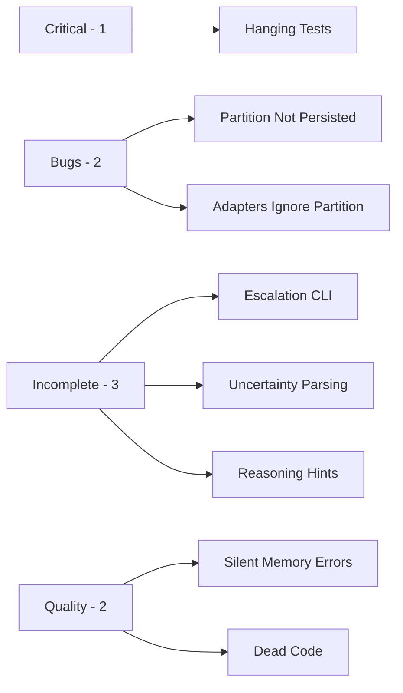

# Issues and Fixes

Post-implementation audit of the [[Feedback Implementation Plan]]. All issues discovered after implementing Phases 0–7.

> [!info] Build Status
> The project **compiles cleanly** (1 minor dead-code warning) and all **137 unit tests pass**. The issues below are architectural gaps, incomplete wiring, and pre-existing problems.

---

## First Deployment Blockers (Program 16)

| Blocker | Status | Plan Link |
|---|---|---|
| Quality gates not green (`fmt`, strict `clippy`) | Open | [[16-01-Restore Quality Gates]] |
| Production runtime config uses temporary paths | Open | [[16-02-Harden Production Config]] |
| Missing canonical Docker deployment artifacts | Open | [[16-03-Add Container Deployment Artifacts]] |
| Security deployment acceptance scenarios not centralized | Open | [[16-04-Security Readiness Closure]] |
| Release version/tag baseline not defined | Open | [[16-05-Release Versioning and Tagging]] |
| Launch go/no-go checklist not unified | Open | [[16-06-Preflight and Launch Checklist]] |

**Program references:**
- [[16-First Deployment Readiness Program]]
- [[First Deployment Readiness Plan]]
- [[First Deployment Readiness Data Flow]]
- [[First Deployment Readiness Research Synthesis]]

---

## Critical

### 1. Integration Tests Hang Indefinitely

| Field | Value |
|---|---|
| **Severity** | Critical |
| **Status** | Open |
| **Files** | `crates/agentos-cli/tests/integration_test.rs` |
| **Tests** | `test_run_task_nonexistent_agent`, `test_task_with_tool_call` |

**Problem:** Two integration tests hang forever and never complete. The kernel spawns 4 infinite background loops (acceptor, executor, timeout checker, scheduler) via `tokio::spawn()` during test setup. When the test finishes, the `_kernel` handle is dropped but the spawned tasks keep running with no shutdown signal.

**Root Cause:** No graceful shutdown mechanism exists. The loops in `run_loop.rs` and `task_executor.rs` use bare `loop {}` with no cancellation token or shutdown channel.

**Affected Loops:**
- `run_loop.rs:38–50` — Acceptor loop (`loop { match kernel.bus.accept()... }`)
- `task_executor.rs:11–26` — Executor loop (`loop { ... }` with 100ms sleeps)
- `run_loop.rs:63–68` — Timeout checker loop
- `run_loop.rs:72–75` — Scheduler loop

**Fix:**
1. Add a `tokio_util::sync::CancellationToken` to `Kernel`
2. Replace `loop {}` with `loop { tokio::select! { _ = token.cancelled() => break, ... } }` in all 4 loops
3. Add `#[tokio::test(flavor = "multi_thread", worker_threads = 2)]` with `tokio::time::timeout` wrappers to integration tests
4. Call `kernel.shutdown()` at end of each test

**Temporary deployment mitigation (2026-03-12):**
- Marked 6 CLI integration tests in `crates/agentos-cli/tests/integration_test.rs` as `#[ignore = "Requires running kernel/bus; tracked in Issues and Fixes.md"]`.
- This keeps CI and local test runs from hanging while kernel lifecycle wiring is completed.
- Remaining action: implement deterministic in-process kernel lifecycle harness and remove `#[ignore]`.

```rust
// Example fix for task_executor_loop
pub(crate) async fn task_executor_loop(self: &Arc<Self>) {
    loop {
        tokio::select! {
            _ = self.cancellation_token.cancelled() => break,
            _ = tokio::time::sleep(Duration::from_millis(100)) => {
                if self.scheduler.running_count().await
                    >= self.config.kernel.max_concurrent_tasks
                {
                    continue;
                }
                if let Some(task) = self.scheduler.dequeue().await {
                    let kernel = self.clone();
                    tokio::spawn(async move {
                        kernel.execute_task(&task).await;
                    });
                }
            }
        }
    }
}
```

---

## Bugs

### 2. `execute_switch_partition` Doesn't Persist Changes

| Field | Value |
|---|---|
| **Severity** | Medium — Bug |
| **Status** | Open |
| **File** | `crates/agentos-kernel/src/kernel_action.rs:395–424` |

**Problem:** `get_context()` returns a **clone** of the `ContextWindow`. The method calls `set_partition()` on the clone, which is then dropped. The original context in `ContextManager` is never updated.

```rust
// Current (broken)
let mut windows = self.context_manager.get_context(&task.id).await;
match &mut windows {
    Ok(ctx) => {
        ctx.set_partition(target_partition); // modifies a clone — lost on drop
        KernelActionResult { success: true, /* ... */ }
    }
    // ...
}
```

**Fix:** Add an `update_context` or `set_partition_for_task` method to `ContextManager` that writes through to the internal `RwLock<HashMap>`:

```rust
// In ContextManager
pub async fn set_partition_for_task(
    &self,
    task_id: &TaskID,
    partition: ContextPartition,
) -> Result<(), AgentOSError> {
    let mut windows = self.windows.write().await;
    match windows.get_mut(task_id) {
        Some(window) => {
            window.set_partition(partition);
            Ok(())
        }
        None => Err(AgentOSError::TaskNotFound(*task_id)),
    }
}
```

Then update `execute_switch_partition` to call this method instead.

---

### 3. LLM Adapters Ignore Context Partitions

| Field | Value |
|---|---|
| **Severity** | Medium — Architectural |
| **Status** | Open |
| **Files** | `crates/agentos-llm/src/openai.rs:45`, `anthropic.rs:36`, `gemini.rs:37`, `ollama.rs:65`, `custom.rs:40` |

**Problem:** All LLM adapters use `context.as_entries()` which returns **all** entries including `Scratchpad` partition entries. The `active_entries()` method exists in `ContextWindow` but is never called.

**Impact:** Scratchpad entries (agent working memory) are sent to the LLM, defeating the purpose of the partition system added in Phase 7.

**Fix:** Replace `as_entries()` with `active_entries()` in all adapter `format_messages` / `format_contents` methods. Since `active_entries()` returns `Vec<&ContextEntry>` instead of `&[ContextEntry]`, the adapter iteration code needs minor adjustment:

```rust
// Before
for entry in context.as_entries() { ... }

// After
for entry in context.active_entries() { ... }
```

> [!warning]
> This also requires updating the `LLMCore::infer()` trait signature or filtering at the call site in `task_executor.rs` before passing context to the adapter. Filtering at the call site is simpler and avoids changing the trait.

---

## Incomplete Features

### 4. Escalation Resolution Not Wired to CLI/API

| Field | Value |
|---|---|
| **Severity** | Medium — Incomplete |
| **Status** | Open |
| **File** | `crates/agentos-kernel/src/escalation.rs:115–136` |

**Problem:** `EscalationManager::resolve()` exists and is unit-tested, but there is **no CLI command or API endpoint** to call it. Escalations can be created (via `kernel_action.rs`) but humans have no way to respond to them.

**Missing Pieces:**
- No `KernelCommand::ResolveEscalation` variant in `run_loop.rs`
- No `agentctl escalation list` / `agentctl escalation resolve` CLI subcommands
- No API route for escalation management
- Blocking escalations set `TaskState::Waiting` but nothing can resume them

**Fix:** Add a full escalation CLI module:

```
crates/agentos-cli/src/commands/escalation.rs  (new)
├── agentctl escalation list [--pending]
├── agentctl escalation show <id>
└── agentctl escalation resolve <id> --decision <text>
```

Wire these to new `KernelCommand` variants in `run_loop.rs`, and on resolve, transition the waiting task back to `TaskState::Running`.

---

### 5. Uncertainty Parsing Not Implemented

| Field | Value |
|---|---|
| **Severity** | Low — Stub |
| **Status** | Open |
| **Files** | `crates/agentos-llm/src/types.rs:9–26`, all LLM adapters |

**Problem:** `UncertaintyDeclaration` struct is defined with fields (`overall_confidence`, `uncertain_claims`, `suggested_verification`) and added to `InferenceResult`, but:
- All adapters hardcode `uncertainty: None`
- No code parses `[UNCERTAINTY]` blocks from LLM responses
- No system prompt instructs the LLM to emit uncertainty blocks

**Fix:**
1. Add a post-processing function that scans `inference.text` for `[UNCERTAINTY]...[/UNCERTAINTY]` blocks
2. Parse the block content into `UncertaintyDeclaration`
3. Call this from each adapter's `infer()` before returning, or centrally in `task_executor.rs`
4. Append uncertainty instructions to the system prompt in `execute_task_sync()`

```rust
/// Parse uncertainty declarations from LLM response text.
fn parse_uncertainty(text: &str) -> Option<UncertaintyDeclaration> {
    let start = text.find("[UNCERTAINTY]")?;
    let end = text.find("[/UNCERTAINTY]")?;
    let block = &text[start + 13..end].trim();
    // Parse structured fields from block...
    Some(UncertaintyDeclaration { /* ... */ })
}
```

---

### 6. Reasoning Hints Always `None`

| Field | Value |
|---|---|
| **Severity** | Low — Stub |
| **Status** | Open |
| **Files** | `crates/agentos-kernel/src/commands/task.rs:74,175`, `crates/agentos-types/src/task.rs:21–23,48–57` |

**Problem:** `TaskReasoningHints` (with `ComplexityLevel` and `PreemptionLevel`) is defined and wired into the timeout multiplier logic in `scheduler.rs:195–202`, but every task creation site sets `reasoning_hints: None`. The timeout multiplier logic is never triggered.

**Fix:** Two options:
1. **Automatic**: Infer complexity from prompt length / tool count / agent type and set hints at task creation
2. **Manual**: Add `--complexity` and `--preemption` flags to `agentctl task run` CLI command

```rust
// In cmd_run_task, after routing
let reasoning_hints = Some(TaskReasoningHints {
    complexity: infer_complexity(&prompt),
    preemption_sensitivity: PreemptionLevel::Normal,
    estimated_steps: None,
    requires_human_review: false,
});
```

---

## Code Quality

### 7. Episodic Memory Errors Silently Swallowed

| Field | Value |
|---|---|
| **Severity** | Medium — Silent Failures |
| **Status** | Open |
| **File** | `crates/agentos-kernel/src/task_executor.rs` |
| **Lines** | 191, 229, 299, 396, 505, 542, 575 |

**Problem:** All 7 episodic memory `.record()` calls use `.ok()` to discard errors. If the SQLite database fails (disk full, corruption, permissions), no warning is logged and the task continues as if nothing happened.

**Fix:** Replace `.ok()` with logged error handling:

```rust
// Before
self.episodic_memory.record(/* ... */).ok();

// After
if let Err(e) = self.episodic_memory.record(/* ... */) {
    tracing::warn!(task_id = %task.id, error = %e, "Failed to record episodic memory");
}
```

---

### 8. Dead Code and Unused Imports

| Field | Value |
|---|---|
| **Severity** | Low — Cleanup |
| **Status** | Open |

| Item | File | Line(s) | Fix |
|---|---|---|---|
| `has_dependencies()` method | `scheduler.rs` | 83–85 | Remove or mark `#[allow(dead_code)]` if needed for future use |
| `max_concurrent` field | `scheduler.rs` | 11–12 | Already has `#[allow(dead_code)]` — wire it into executor loop or remove |
| `make_engine()` test helper | `capability/engine.rs` | 263–271 | Remove unused test helper |
| Unused `input` variable | `pipeline/engine.rs` | 412 | Rename to `_input` |
| Unused imports in tests | `agent_registry.rs` | 251–252 | Remove `agentos_types::*` and `Duration` from test module |

**Fix:** Run `cargo fix --lib -p agentos-kernel --tests` to auto-fix unused imports, then manually clean up dead methods.

---

## Summary



| Priority | Count | Issues |
|---|---|---|
| Critical | 1 | [[#1. Integration Tests Hang Indefinitely]] |
| Medium | 4 | [[#2. execute_switch_partition Doesn't Persist Changes\|#2]], [[#3. LLM Adapters Ignore Context Partitions\|#3]], [[#4. Escalation Resolution Not Wired to CLI/API\|#4]], [[#7. Episodic Memory Errors Silently Swallowed\|#7]] |
| Low | 3 | [[#5. Uncertainty Parsing Not Implemented\|#5]], [[#6. Reasoning Hints Always None\|#6]], [[#8. Dead Code and Unused Imports\|#8]] |

> [!tip] Recommended Order
> Fix in this order: **1 → 2 → 3 → 4 → 7 → 8 → 5 → 6**
> The critical test fix unblocks CI. The bugs (#2, #3) break shipped features. The incomplete features (#5, #6) are stubs that work fine as `None` until wired.
