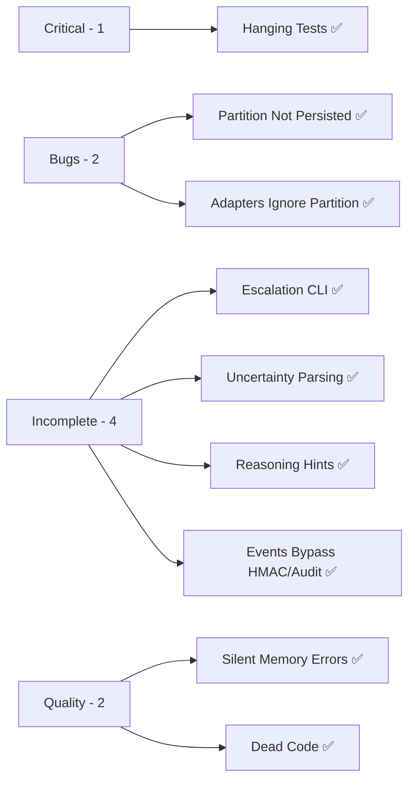

# Issues and Fixes

Post-implementation audit of the [[Feedback Implementation Plan]]. All issues discovered after implementing Phases 0–7.

> [!info] Build Status (updated 2026-03-16)
> The project **compiles cleanly** and all unit tests pass. **All 9 original issues have been resolved.** Integration tests now run with full kernel lifecycle harness. Docker deployment artifacts added.

---

## First Deployment Blockers (Program 16)

| Blocker | Status | Plan Link |
|---|---|---|
| Quality gates not green (`fmt`, strict `clippy`) | Resolved (2026-03-16) — clippy fixed in [[01-clippy-ci-gate-fixes]]; fmt already passes | [[16-01-Restore Quality Gates]] |
| Production runtime config uses temporary paths | Open | [[16-02-Harden Production Config]] |
| Missing canonical Docker deployment artifacts | Resolved (2026-03-16) — Dockerfile, docker-compose.yml, config/docker.toml added in [[04-docker-deployment-artifacts]] | [[16-03-Add Container Deployment Artifacts]] |
| Security deployment acceptance scenarios not centralized | Resolved (2026-03-16) — all 7 scenarios pass; docs added to `06-security.md` and `agentic-os-deployment.md` | [[16-04-Security Readiness Closure]] |
| Release version/tag baseline not defined | Open | [[16-05-Release Versioning and Tagging]] |
| Launch go/no-go checklist not unified | Open | [[16-06-Preflight and Launch Checklist]] |

**Program references:**
- [[16-First Deployment Readiness Program]]
- [[First Deployment Readiness Plan]]
- [[First Deployment Readiness Data Flow]]
- [[First Deployment Readiness Research Synthesis]]

---

## Clippy Errors (found 2026-03-13, fixed 2026-03-16)

4 clippy errors were discovered post-audit and fixed in [[01-clippy-ci-gate-fixes]]:

| Error | File | Fix |
|---|---|---|
| `if_same_then_else` | `commands/escalation.rs` | Collapsed identical `Info` branches |
| `collapsible_if` | `event_bus.rs` | Merged nested `if` |
| `unwrap_or_default` | `event_dispatch.rs` | Replaced `unwrap_or_else(TraceID::new)` with `unwrap_or_default()` |
| `new_without_default` | `memory_extraction.rs` | Added `Default` impl for `ExtractionRegistry` |

---

## Critical

### 1. Integration Tests Hang Indefinitely

| Field | Value |
|---|---|
| **Severity** | Critical |
| **Status** | Resolved (2026-03-16) |
| **Files** | `crates/agentos-cli/tests/integration_test.rs` |

**Resolution:** `CancellationToken` added to `Kernel` struct. All 9 loops in `run_loop.rs` use `tokio::select!` with the token. `Kernel::shutdown()` method exists and cancels the token, which aborts all tasks in the supervisor `JoinSet`. All 6 integration tests now run without `#[ignore]` annotations, wrapped in `tokio::time::timeout(120s)` with `kernel.shutdown()` cleanup. Test config uses a shared model cache directory (`target/test-model-cache`) so the ~23MB embedding model is downloaded once and reused across runs.

---

## Bugs

### 2. `execute_switch_partition` Doesn't Persist Changes

| Field | Value |
|---|---|
| **Severity** | Medium — Bug |
| **Status** | Resolved (2026-03-13) |
| **File** | `crates/agentos-kernel/src/context.rs:176` |

**Resolution:** `ContextManager::set_partition_for_task()` implemented in `context.rs:176`. The method writes through to the internal `RwLock<HashMap>` instead of operating on a clone.

---

### 3. LLM Adapters Ignore Context Partitions

| Field | Value |
|---|---|
| **Severity** | Medium — Architectural |
| **Status** | Resolved (2026-03-13) |
| **Files** | `crates/agentos-llm/src/openai.rs`, `anthropic.rs`, `gemini.rs`, `ollama.rs`, `custom.rs` |

**Resolution:** All 5 production LLM adapters now call `context.active_entries()` instead of `as_entries()`. Only the Ollama test helper uses `as_entries()` (acceptable for test construction).

---

## Incomplete Features

### 4. Escalation Resolution Not Wired to CLI/API

| Field | Value |
|---|---|
| **Severity** | Medium — Incomplete |
| **Status** | Resolved (2026-03-13) |
| **Files** | `crates/agentos-cli/src/commands/escalation.rs`, `crates/agentos-kernel/src/commands/escalation.rs` |

**Resolution:** Full escalation CLI implemented: `agentctl escalation list [--all]`, `agentctl escalation get <id>`, `agentctl escalation resolve <id> --decision <text>`. `KernelCommand::ListEscalations`, `GetEscalation`, `ResolveEscalation` wired in `run_loop.rs`. Resolution handles task requeue for approved blocking escalations and task failure for denied ones.

---

### 5. Uncertainty Parsing Not Implemented

| Field | Value |
|---|---|
| **Severity** | Low — Stub |
| **Status** | Resolved (2026-03-13) |
| **Files** | `crates/agentos-llm/src/types.rs:163` |

**Resolution:** `parse_uncertainty()` function implemented in `agentos-llm/src/types.rs:163`. Called in `task_executor.rs` after each `infer()` call. Parses `[UNCERTAINTY]...[/UNCERTAINTY]` blocks with `confidence`, `claim`, and `verify` fields. Unit tests cover parsing.

---

### 6. Reasoning Hints Always `None`

| Field | Value |
|---|---|
| **Severity** | Low — Stub |
| **Status** | Resolved (2026-03-13) |
| **Files** | `crates/agentos-kernel/src/commands/task.rs:292` |

**Resolution:** `infer_reasoning_hints()` function in `commands/task.rs:292` auto-infers `ComplexityLevel` and `PreemptionLevel` from prompt word count. Called for both `cmd_run_task` and `cmd_delegate_task`. Background and event-triggered tasks correctly leave hints as `None` (automated tasks have no user prompt to analyze).

---

### 9. Communication and Schedule Events Bypass HMAC Signing and Audit Log

| Field | Value |
|---|---|
| **Severity** | Medium — Architectural Debt |
| **Status** | Resolved (2026-03-13) |
| **Files** | `crates/agentos-kernel/src/agent_message_bus.rs`, `crates/agentos-kernel/src/schedule_manager.rs` |

**Resolution:** Both subsystems now use lightweight notification channels (`CommNotification`, `ScheduleNotification`) instead of raw `event_sender` injection. The kernel's `run_loop.rs` receives these notifications via dedicated listeners (`CommNotificationListener`, `ScheduleNotificationListener`) and converts them into properly HMAC-signed `EventMessage` values with audit trail entries via `self.emit_event(...)`.

---

## Code Quality

### 7. Episodic Memory Errors Silently Swallowed

| Field | Value |
|---|---|
| **Severity** | Medium — Silent Failures |
| **Status** | Resolved (2026-03-13) |
| **File** | `crates/agentos-kernel/src/task_executor.rs` |

**Resolution:** All episodic memory `.record()` calls now use `if let Err(e) = ... { tracing::warn!(task_id = %task.id, error = %e, "Failed to record episodic memory"); }` pattern. Task success and failure records use `match` with explicit `Ok`/`Err` arms.

---

### 8. Dead Code and Unused Imports

| Field | Value |
|---|---|
| **Severity** | Low — Cleanup |
| **Status** | Resolved (2026-03-13) |

**Resolution:** `has_dependencies()` method removed. `make_engine()` test helper removed. `_input` already prefixed. 4 new clippy errors found and fixed in [[01-clippy-ci-gate-fixes]].

---

## Summary

| Priority | Count | Issues | Status |
|---|---|---|---|
| Critical | 1 | #1 Integration Tests | Resolved |
| Medium | 5 | #2, #3, #4, #7, #9 | All Resolved |
| Low | 3 | #5, #6, #8 | All Resolved |

> [!success] All 9 issues resolved
> All issues from the original audit have been addressed. Remaining deployment blockers are tracked in the First Deployment Blockers table above.
