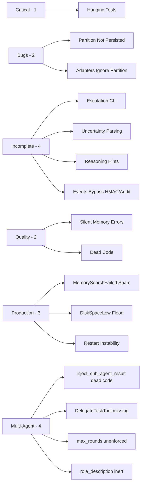

# Issues and Fixes

Post-implementation audit of the [[Feedback Implementation Plan]]. All issues discovered after implementing Phases 0--7.

> [!info] Build Status (updated 2026-03-17)
> The project **compiles cleanly** and all unit tests pass. **All 9 original issues have been resolved.** Integration tests now run with full kernel lifecycle harness. Docker deployment artifacts added.

---

## Multi-Agent Coordination Last-Mile (2026-04-03)

Four issues discovered during review of the multi-agent coordination feature (Phases 1--4). These are bugs and gaps in already-implemented code on `feat/multi-agent-coordination`.

| # | Issue | Severity | Status | Fix Location |
|---|-------|----------|--------|--------------|
| 13 | `inject_sub_agent_result()` exists in `context.rs` but is never called from `cmd_await_sub_agents` -- child results are never injected into parent context | Critical | Planned | `crates/agentos-kernel/src/commands/sub_agent.rs` ~line 302 + `crates/agentos-kernel/src/context.rs` |
| 14 | `delegate_task` registered in `crates/agentos-tools/src/lib.rs` line 200 but the `DelegateTaskTool` struct/impl does not exist in `coordination.rs` -- tool exists separately as `TaskDelegate` in `task_delegate.rs` with name `task-delegate` | High | Planned | `crates/agentos-tools/src/coordination.rs` |
| 15 | `TeamConfig.max_rounds` field exists but `cmd_run_team` never reads or enforces it -- coordinator can loop forever | High | Planned | `crates/agentos-kernel/src/commands/team.rs` |
| 16 | `TeamMember.role_description` is parsed from TOML but never injected into coordinator system prompt -- role specialization is inert | Medium | Planned | `crates/agentos-kernel/src/commands/team.rs` |

> [!note] Issue 16 Nuance
> The worker roster _does_ include `role_description` in the coordinator prompt (line 88-93 of `team.rs`), but the coordinator's _own_ `role_description` is only used when non-empty. The actual gap is that worker role descriptions are formatted but not used as system-level instructions that guide the coordinator's delegation strategy. The coordinator sees them as labels, not behavioral directives.

### See Also

- [[Event-Driven Completion Plan]]
- [[Task Checkpointing Plan]]
- [[Observability Uplift Plan]]

---

## Production Stability Issues (discovered 2026-03-17)

Three critical issues found through audit log analysis (96 entries, 50 minutes of runtime). Full fix plan: [[Production Stability Fixes Plan]]

| # | Issue | Severity | Status | Plan Link |
|---|-------|----------|--------|-----------|
| 10 | MemorySearchFailed on every event-triggered task (empty retrieval treated as error) | Critical | Planned | [[24-01-Retrieval Result Typing]], [[24-02-Skip Retrieval for Bootstrap Tasks]] |
| 11 | DiskSpaceLow event spam: 6 events per health check cycle (per-mount emission, in-memory debounce resets on restart) | High | Planned | [[24-03-Aggregate Disk Health Events]], [[24-04-Persist Health Debounce State]] |
| 12 | Kernel restart instability: 4 unclean restarts in 50 min, no KernelStopped events, agent identity lost | Critical | Planned | [[24-05-Graceful Shutdown Audit Trail]], [[24-06-Agent Identity Reuse on Reconnect]], [[24-07-Boot Pre-flight Checks]], [[24-08-Exponential Restart Backoff]] |

---

## First Deployment Blockers (Program 16)

| Blocker | Status | Plan Link |
|---|---|---|
| Quality gates not green (`fmt`, strict `clippy`) | Resolved (2026-03-16) -- clippy fixed in [[01-clippy-ci-gate-fixes]]; fmt already passes | [[16-01-Restore Quality Gates]] |
| Production runtime config uses temporary paths | Open | [[16-02-Harden Production Config]] |
| Missing canonical Docker deployment artifacts | Resolved (2026-03-16) -- Dockerfile, docker-compose.yml, config/docker.toml added in [[04-docker-deployment-artifacts]] | [[16-03-Add Container Deployment Artifacts]] |
| Security deployment acceptance scenarios not centralized | Resolved (2026-03-16) -- all 7 scenarios pass; docs added to `06-security.md` and `agentic-os-deployment.md` | [[16-04-Security Readiness Closure]] |
| Release version/tag baseline not defined | Open | [[16-05-Release Versioning and Tagging]] |
| Launch go/no-go checklist not unified | Open | [[16-06-Preflight and Launch Checklist]] |

**Program references:**
- [[16-First Deployment Readiness Program]]
- [[First Deployment Readiness Plan]]
- [[First Deployment Readiness Data Flow]]
- [[First Deployment Readiness Research Synthesis]]

---

## Clippy Errors (found 2026-03-13, fixed 2026-03-16)

4 clippy errors were discovered post-audit and fixed in [[01-clippy-ci-gate-fixes]]:

| Error | File | Fix |
|---|---|---|
| `if_same_then_else` | `commands/escalation.rs` | Collapsed identical `Info` branches |
| `collapsible_if` | `event_bus.rs` | Merged nested `if` |
| `unwrap_or_default` | `event_dispatch.rs` | Replaced `unwrap_or_else(TraceID::new)` with `unwrap_or_default()` |
| `new_without_default` | `memory_extraction.rs` | Added `Default` impl for `ExtractionRegistry` |

---

## Critical

### 1. Integration Tests Hang Indefinitely

| Field | Value |
|---|---|
| **Severity** | Critical |
| **Status** | Resolved (2026-03-16) |
| **Files** | `crates/agentos-cli/tests/integration_test.rs` |

**Resolution:** `CancellationToken` added to `Kernel` struct. All 9 loops in `run_loop.rs` use `tokio::select!` with the token. `Kernel::shutdown()` method exists and cancels the token, which aborts all tasks in the supervisor `JoinSet`. All 6 integration tests now run without `#[ignore]` annotations, wrapped in `tokio::time::timeout(120s)` with `kernel.shutdown()` cleanup. Test config uses a shared model cache directory (`target/test-model-cache`) so the ~23MB embedding model is downloaded once and reused across runs.

---

## Bugs

### 2. `execute_switch_partition` Doesn't Persist Changes

| Field | Value |
|---|---|
| **Severity** | Medium -- Bug |
| **Status** | Resolved (2026-03-13) |
| **File** | `crates/agentos-kernel/src/context.rs:176` |

**Resolution:** `ContextManager::set_partition_for_task()` implemented in `context.rs:176`. The method writes through to the internal `RwLock<HashMap>` instead of operating on a clone.

---

### 3. LLM Adapters Ignore Context Partitions

| Field | Value |
|---|---|
| **Severity** | Medium -- Architectural |
| **Status** | Resolved (2026-03-13) |
| **Files** | `crates/agentos-llm/src/openai.rs`, `anthropic.rs`, `gemini.rs`, `ollama.rs`, `custom.rs` |

**Resolution:** All 5 production LLM adapters now call `context.active_entries()` instead of `as_entries()`. Only the Ollama test helper uses `as_entries()` (acceptable for test construction).

---

## Incomplete Features

### 4. Escalation Resolution Not Wired to CLI/API

| Field | Value |
|---|---|
| **Severity** | Medium -- Incomplete |
| **Status** | Resolved (2026-03-13) |
| **Files** | `crates/agentos-cli/src/commands/escalation.rs`, `crates/agentos-kernel/src/commands/escalation.rs` |

**Resolution:** Full escalation CLI implemented: `agentctl escalation list [--all]`, `agentctl escalation get <id>`, `agentctl escalation resolve <id> --decision <text>`. `KernelCommand::ListEscalations`, `GetEscalation`, `ResolveEscalation` wired in `run_loop.rs`. Resolution handles task requeue for approved blocking escalations and task failure for denied ones.

---

### 5. Uncertainty Parsing Not Implemented

| Field | Value |
|---|---|
| **Severity** | Low -- Stub |
| **Status** | Resolved (2026-03-13) |
| **Files** | `crates/agentos-llm/src/types.rs:163` |

**Resolution:** `parse_uncertainty()` function implemented in `agentos-llm/src/types.rs:163`. Called in `task_executor.rs` after each `infer()` call. Parses `[UNCERTAINTY]...[/UNCERTAINTY]` blocks with `confidence`, `claim`, and `verify` fields. Unit tests cover parsing.

---

### 6. Reasoning Hints Always `None`

| Field | Value |
|---|---|
| **Severity** | Low -- Stub |
| **Status** | Resolved (2026-03-13) |
| **Files** | `crates/agentos-kernel/src/commands/task.rs:292` |

**Resolution:** `infer_reasoning_hints()` function in `commands/task.rs:292` auto-infers `ComplexityLevel` and `PreemptionLevel` from prompt word count. Called for both `cmd_run_task` and `cmd_delegate_task`. Background and event-triggered tasks correctly leave hints as `None` (automated tasks have no user prompt to analyze).

---

### 9. Communication and Schedule Events Bypass HMAC Signing and Audit Log

| Field | Value |
|---|---|
| **Severity** | Medium -- Architectural Debt |
| **Status** | Resolved (2026-03-13) |
| **Files** | `crates/agentos-kernel/src/agent_message_bus.rs`, `crates/agentos-kernel/src/schedule_manager.rs` |

**Resolution:** Both subsystems now use lightweight notification channels (`CommNotification`, `ScheduleNotification`) instead of raw `event_sender` injection. The kernel's `run_loop.rs` receives these notifications via dedicated listeners (`CommNotificationListener`, `ScheduleNotificationListener`) and converts them into properly HMAC-signed `EventMessage` values with audit trail entries via `self.emit_event(...)`.

---

## Code Quality

### 7. Episodic Memory Errors Silently Swallowed

| Field | Value |
|---|---|
| **Severity** | Medium -- Silent Failures |
| **Status** | Resolved (2026-03-13) |
| **File** | `crates/agentos-kernel/src/task_executor.rs` |

**Resolution:** All episodic memory `.record()` calls now use `if let Err(e) = ... { tracing::warn!(task_id = %task.id, error = %e, "Failed to record episodic memory"); }` pattern. Task success and failure records use `match` with explicit `Ok`/`Err` arms.

---

### 8. Dead Code and Unused Imports

| Field | Value |
|---|---|
| **Severity** | Low -- Cleanup |
| **Status** | Resolved (2026-03-13) |

**Resolution:** `has_dependencies()` method removed. `make_engine()` test helper removed. `_input` already prefixed. 4 new clippy errors found and fixed in [[01-clippy-ci-gate-fixes]].

---

## Summary

```mermaid
graph LR
    A[Critical - 1] --> A1[Hanging Tests]
    B[Bugs - 2] --> B1[Partition Not Persisted]
    B --> B2[Adapters Ignore Partition]
    C[Incomplete - 4] --> C1[Escalation CLI]
    C --> C2[Uncertainty Parsing]
    C --> C3[Reasoning Hints]
    C --> C4[Events Bypass HMAC/Audit]
    D[Quality - 2] --> D1[Silent Memory Errors]
    D --> D2[Dead Code]
    E[Production - 3] --> E1[MemorySearchFailed Spam]
    E --> E2[DiskSpaceLow Flood]
    E --> E3[Restart Instability]
    F[Multi-Agent - 4] --> F1[inject_sub_agent_result dead code]
    F --> F2[DelegateTaskTool missing]
    F --> F3[max_rounds unenforced]
    F --> F4[role_description inert]
```

| Priority | Count | Issues | Status |
|---|---|---|---|
| Critical | 1 | #1 Integration Tests | Resolved |
| Medium | 5 | #2, #3, #4, #7, #9 | All Resolved |
| Low | 3 | #5, #6, #8 | All Resolved |
| Production | 3 | #10, #11, #12 | Planned -- [[Production Stability Fixes Plan]] |
| Multi-Agent | 4 | #13, #14, #15, #16 | Planned -- [[Event-Driven Completion Plan]] |

> [!success] All 9 original issues resolved
> All issues from the original audit have been addressed. 3 new production stability issues discovered via runtime audit log analysis are tracked in [[Production Stability Fixes Plan]]. 4 multi-agent coordination last-mile issues are tracked above and relate to [[Event-Driven Completion Plan]], [[Task Checkpointing Plan]], and [[Observability Uplift Plan]].
